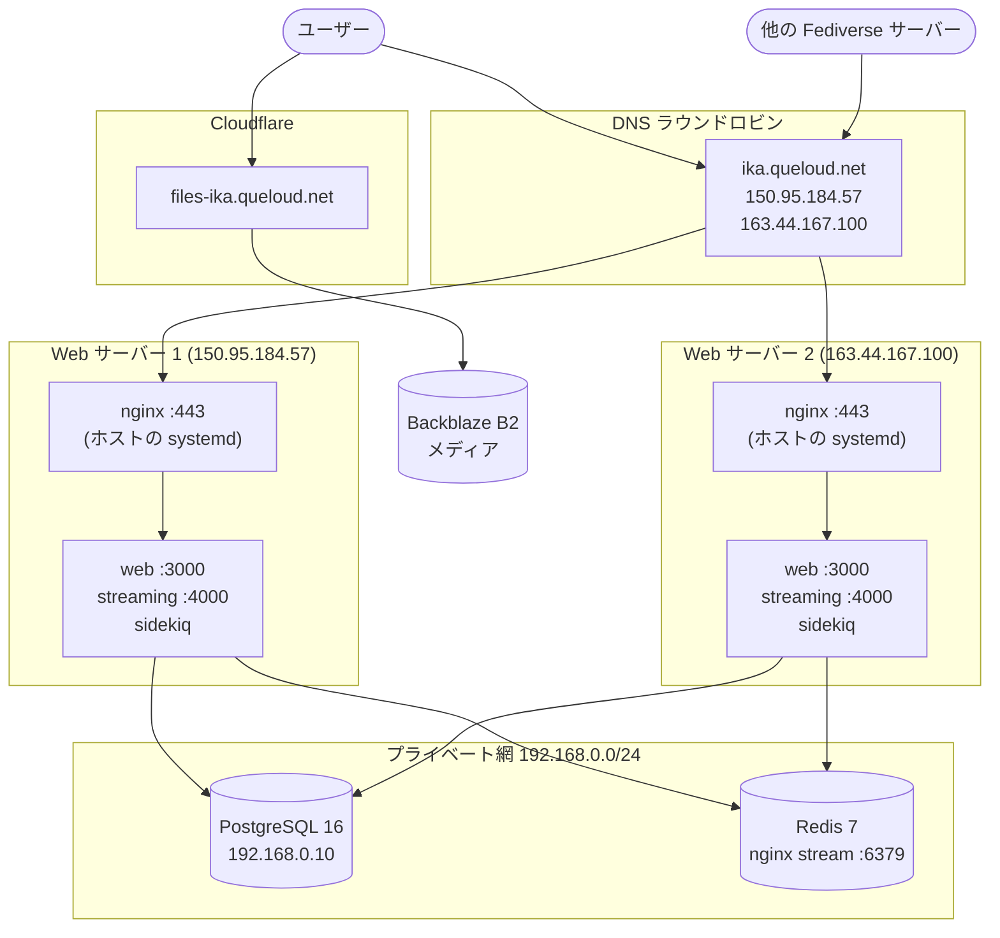

# イカトドン 現状のインフラ構成

このドキュメントは **2026年8月時点の現状** を記録したものです。理想像や今後の方針は
[`target-architecture.md`](./target-architecture.md) を参照してください。

各項目には **根拠** を併記しています。根拠が「聞き取り」または「未確認」のものは、
事実誤認の可能性があります。気づいた点があれば直接修正してください。

---

## 1. 全体図



**ロードバランサはありません。** DNS に A レコードを2つ置くことで振り分けています。

**Cloudflare は本体には噛んでいません。** メディア配信（`files-ika.queloud.net`）にだけ
使われていて、`ika.queloud.net` は ConoHa の IP がそのまま公開されています。

> 根拠: `getent hosts ika.queloud.net` が `150.95.184.57` / `163.44.167.100` を返す。
> Cloudflare がプロキシしていれば `104.x` / `172.67.x` 等が返るはず。
> `files-ika.queloud.net` は `2606:4700:3032::...`（Cloudflare の範囲）を返す。

---

## 2. サーバー一覧

| 役割 | 台数 | ホスト | 管理方法 |
| --- | --- | --- | --- |
| Web | **2台** | `150.95.184.57` / `163.44.167.100` | 手動。リポジトリを git clone し `docker compose` |
| DB | 1台 | プライベート `192.168.0.10` | [`ikatodon-db`](https://github.com/koba-lab/ikatodon-db) の Ansible |
| Redis | 1台 | プライベート網内 | [`ikatodon-redis`](https://github.com/koba-lab/ikatodon-redis) の compose |

いずれも ConoHa VPS（Ubuntu 24 系）。

> nginx の `upstream acme-challenge` には4つの IP が登録されていますが、
> **`150.95.138.129` と `133.130.122.196` は古い IP の残骸**です（聞き取りで確認）。
> Let's Encrypt 更新時に到達しない IP へ転送を試みることになるため、掃除の対象です。

---

## 3. ネットワーク

**Web / DB / Redis はすべてプライベート網 `192.168.0.0/24` に載っています。**

> 根拠: `ikatodon-redis/conf/nginx/conf.d/redis.conf` が `allow 192.168.0.0/24; deny all;` で
> Redis を保護しており、`ikatodon-db/deploy-postgres.yml` が生成する `pg_hba.conf` も
> 同じ範囲のみを許可している。Web から両方へ到達できている以上、Web の送信元 IP は
> この範囲にある。

ConoHa のプライベートネットワークは**転送量課金の対象外**です。

| 経路 | 内容 |
| --- | --- |
| Web → DB | `192.168.0.10:5432` |
| Web → Redis | プライベート網内の `:6379`（nginx stream 経由） |
| Web ↔ Web | **現在は使っていない** |

---

## 4. アプリケーション

### 4.1 コンテナ構成

`docker-compose.yml` のうち、実際に動くのは3サービスです。`db` / `redis` / `es` は
すべてコメントアウトされています。

| サービス | イメージ | コマンド | 公開ポート |
| --- | --- | --- | --- |
| `web` | `ghcr.io/koba-lab/ikatodon` | `bundle exec puma -C config/puma.rb` | `127.0.0.1:3000` |
| `streaming` | `ghcr.io/koba-lab/ikatodon-streaming` | `node ./streaming/index.js` | `127.0.0.1:4000` |
| `sidekiq` | `ghcr.io/koba-lab/ikatodon` | `bundle exec sidekiq` | — |

**ポートは `127.0.0.1` にのみバインドされているため、隣のサーバーからは到達できません。**

### 4.2 バージョン管理

イメージタグは `docker-compose.yml` に**べた書き**されています。

```yaml
image: ghcr.io/koba-lab/ikatodon:v4.6.4
```

手順の `git pull` がそのままバージョン切り替えを兼ねています。

**本家 Mastodon もこの行にバージョンを書いているため、本家を取り込むたびに
同じ行で衝突します。** 過去3年の `docker-compose.yml` の変更41件のうち、大半が
「Bump version to vX」による3行の変更でした。

### 4.3 イメージのビルド

`.github/workflows/ikatodon-build.yml` が**タグ push をトリガ**に、
`ghcr.io/koba-lab/ikatodon` と `ghcr.io/koba-lab/ikatodon-streaming` を
ビルドして push します。デプロイは自動化されていません。

### 4.4 ブランチ

`master` と `ikatodon` ブランチは、現時点で内容が同一です。

### 4.5 環境変数

`.env.production` は `.gitignore` で除外されており、**各ホストに手で置かれています**。

---

## 5. nginx

**Docker の外、ホストの systemd で動いています**（`user mastodon`）。
設定は `/etc/nginx/sites-available/ika.queloud.net`。

`docker compose down` してもnginx 自体は生き続けるため、502 を返す状態になります。

### 5.1 持っている責務

| 機能 | 内容 |
| --- | --- |
| TLS 終端 | Let's Encrypt。`ssl_protocols TLSv1.2` |
| アプリへの転送 | `proxy_pass http://127.0.0.1:3000` / `:4000` |
| LE 更新の転送 | `upstream acme-challenge` に全台を登録し `proxy_next_upstream http_404` |
| **メンテナンス画面** | `/var/www/html/maintenance.html` が存在すると 503 → メンテ画面 |
| **管理者バイパス** | `geo $allow_ip` に列挙された IP はメンテ中も通常表示 |
| メディアのリダイレクト | `/ikatodon-media/` → `files-ika.queloud.net` へ 301 |
| 静的アセット | `/emoji`, `/packs`, `system/...` に長期キャッシュヘッダ |
| gzip | 有効 |

### 5.2 メンテナンス画面の仕組み

ファイルを1つ置くだけで切り替わり、指定 IP からは通常どおり閲覧できます。

```nginx
if (-e /var/www/html/maintenance.html) { set $maintenance true; }
if ($allow_ip ~ allow)                 { set $maintenance false; }
if ($maintenance = true)               { return 503; }
```

---

## 6. 現在のデプロイ手順（手動）

> 根拠: koba-lab さんからの聞き取り

1. db サーバーに ssh して dump を取得し、ローカルへダウンロード
2. 2台とも: `git pull` → `docker login`（ghcr）→ `docker compose pull`
3. **1台目**: pre-migration → `docker compose down && docker compose up -d` → `db:migrate`
   → 本家で必要とされる追加コマンド（ある場合）
4. **2台目**: `docker compose down && docker compose up -d`

**`down` している間のアクセスはエラーになります。** これは把握のうえで許容されています。

---

## 7. バックアップと監視

### 7.1 PostgreSQL

`ikatodon-db` の `deploy-postgres.yml` が、以下をサーバー上に配置する**定義**を持っています。

| パス | 内容 |
| --- | --- |
| `/opt/mastodon/backup.sh` | `pg_dump -Fc` → `/opt/mastodon/backups/`、7日分保持 |
| `/opt/mastodon/restore.sh` | `pg_restore`。**対話式**（y/N 確認あり） |
| `/opt/mastodon/monitor.sh` | 接続数などの診断 |

さらに毎日 02:00 に `backup.sh` を実行する cron の定義もあります。

> ⚠️ **これらが実際に適用されているかは未確認です。**
> この playbook は存在しない `docker-compose.postgres16.yml` を参照しており、
> **そのままでは実行できません**（後述の問題 #1）。途中で失敗した可能性があります。
> `crontab -l -u mastodon` と `ls /opt/mastodon/backups/` で確認が必要です。

dump のサイズは 2〜3GB、所要時間は10分前後（聞き取り）。

### 7.2 その他

- **ConoHa の日次イメージバックアップ**を取得しています（聞き取り）
- **Mackerel** の agent が DB サーバーに常駐（`roles=ikatodon:db`、postgres プラグイン付き）
- Web サーバー側の監視状況は未確認

---

## 8. 既知の問題

### 8.1 確認済み

| # | 問題 | 影響 |
| --- | --- | --- |
| 1 | `ikatodon-db/deploy-postgres.yml` が存在しない `docker-compose.postgres16.yml` を参照している | **Ansible が現状のまま実行できない**。バックアップ機構が入っているかも不明になる |
| 2 | `ikatodon-db/docker-compose.yml` の `PRIVATE_IP` デフォルトが `0.0.0.0` | 設定が抜けると **PostgreSQL が全世界に公開される** |
| 3 | post deployment migration を「1台目だけ新しい」状態で実行している | 全台更新後に走る前提の設計。古いコードが参照中のカラムを落とし得る |
| 4 | 「本家で必要とされる追加コマンド」がどこにも記録されていない | 属人化。自動化の障害にもなる |
| 5 | `restore.sh` が対話式（y/N） | 緊急時に自動復旧できない |
| 6 | Ansible の `docker_compose` モジュールは非推奨 | `community.docker.docker_compose_v2` への移行が必要 |
| 7 | `acme-challenge` upstream に現役でない IP が2つ残っている | LE 更新時に到達しない IP へ転送を試みる |
| 8 | イメージタグを本家の `docker-compose.yml` に直接書いている | **毎リリース同じ行で衝突する** |

### 8.2 確度が低い / 要確認

| # | 疑い | 確認方法 |
| --- | --- | --- |
| 9 | `error_page 500 501 502 504 /home/mastodon/live/public/500.html;` は URI として解釈され `root` と二重連結される。意図した 500.html が出ていない可能性 | 次回デプロイ中に実際の画面を見る |
| 10 | 全台で同じ `bundle exec sidekiq` が動いているなら、`scheduler` キューが多重実行され定期ジョブが2回走っている可能性 | 各ホストの override の有無と sidekiq の起動オプション |
| 11 | `/etc/nginx/nginx.conf` に `ssl_protocols TLSv1 TLSv1.1` が残る（当該 vhost は 1.2 で上書き済みだが他 vhost には影響） | `sudo nginx -T` |
| 12 | Redis の nginx が `ports: 6379:6379` で公開されている。Docker の publish は ufw を迂回することがあり、防御は nginx の `allow/deny` のみに依存 | `sudo ufw status`、外部からの疎通確認 |

---

## 9. 未確認事項

後続の作業で埋める項目です。**コマンドの実行結果を貼れば、そこから作業に入れます。**

```bash
# --- ssh 経路の判断材料 ---
sudo ufw status                                   # SSH に IP 制限があるか

# --- nginx の完全な現状（構成管理の元データ）---
ls /etc/nginx/conf.d/ && cat /etc/nginx/conf.d/*.conf
sudo nginx -T                                     # 暗黙に効いている設定を落とさないため

# --- ネットワーク ---
ip -4 addr                                        # 各 Web サーバーのプライベート IP

# --- バックアップの現状 ---
crontab -l -u mastodon
ls -la /opt/mastodon/backups/
du -sh /var/lib/postgresql/16/data/pg_wal
docker exec mastodon_postgres16 psql -U mastodon -d mastodon_production \
  -c "SELECT * FROM pg_stat_archiver;"

# --- sidekiq の scheduler 重複（問題 #10）---
docker compose config | grep -A3 sidekiq
```

聞き取りが必要なもの：

| 項目 | なぜ必要か |
| --- | --- |
| `.env.production` の管理方法 | 現在ホスト手置き。構成管理に載せるか判断が要る |
| Elasticsearch の有無 | compose ではコメントアウト。`ES_ENABLED` の実態 |
| Web サーバー側の Mackerel 監視 | DB には入っている。Web にもあるか |
| **Web サーバーを Cloudflare 経由にしていない理由** | 記録がどこにも無い。今後の判断材料になる |

---

## 10. このドキュメントの経緯

2026年8月、デプロイ自動化（issue #876）を検討する過程で、
**インフラの全体像がドキュメントとして存在しない**ことが判明したため作成しました。

検討中、以下の推測が実測によって否定されています。同じ誤解を繰り返さないために残します。

| 推測 | 実際 |
| --- | --- |
| Cloudflare Origin CA で Let's Encrypt を撤去できる | Cloudflare は本体経路に居ないため**不可**。LE は現役で必要 |
| `real_ip` 未設定で `geo $allow_ip` が壊れている | **杞憂**。`$remote_addr` は実クライアント IP |
| Cloudflare が1台停止時に他へ回してくれる | 経路に居ない。有料 Load Balancing は費用面で却下済み |
| サーバー間通信には HTTPS が必要 | **不要**。プライベート網があるので平文 HTTP で足りる |
| Web サーバーは4台 | **2台**。残り2 IP は古い設定の残骸 |
