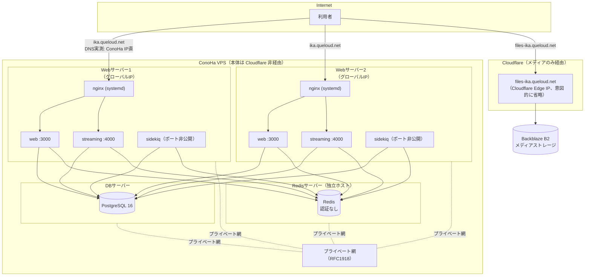

# イカトドン インフラ構成ドキュメント

このドキュメントは、イカトドン（`koba-lab/mastodon`、Mastodon のフォーク）のインフラと運用の
全体像を記録するものです。issue #876「Web サーバーへのデプロイを自動化したい」への対応を
きっかけに、インフラの全体像がドキュメントとして存在しないこと自体が根本の問題だと判明した
ため、まずこのドキュメントを整備します。

トピックごとに「今こうなっている → こうしたい」を並べる構成にしています。各節では
**「決定済み」の内容**と**「要件のみで解決策は実施時に検討する」内容**を明確に書き分けて
います。この区別が無いと、未定の項目を決定済みと誤読して実装してしまう事故が実際に起きた
ため、特に注意して区別してください。

事実には根拠を **実測 / 聞き取り / 未確認** の区分で併記します。未確認のものには ⚠️ を付けて
います。

**細かい実装仕様は、このファイルではなく `infrastructure/` 配下の個別ファイルに分離して
います。** それらは実装時にあらためて検討・検証する draft であり、内容に誤りを含みます。
AI レビューの対象外としています。詳しくは各ファイル冒頭の警告を参照してください。

- [`infrastructure/deploy-design.md`](infrastructure/deploy-design.md) — デプロイ自動化の詳細仕様（draft）
- [`infrastructure/backup-design.md`](infrastructure/backup-design.md) — PITR・鍵管理の詳細仕様（draft）

---

## 1. 全体図



- 本体（`ika.queloud.net`）は Cloudflare を経由せず、ConoHa の IP がそのまま DNS に返る（実測）。
- メディア（`files-ika.queloud.net`）のみ Cloudflare 経由で Backblaze B2 に向いている（実測・
  聞き取り）。メディアは移管済みでこのドキュメントの対象外。
- 構成は **Web 2台・DB 1台・Redis 1台の計4台**。Redis は DB とは別の独立したホストで動いて
  いる（issue #876 の記載 + 実測。以前の版で Redis を DB サーバー内に描いていたのは誤り）。
- Web / DB / Redis はプライベート網（RFC1918）で相互通信する（実測: nginx の `allow` 設定、
  DB の `pg_hba.conf`）。
- `streaming` も PostgreSQL / Redis に直接接続する（実測: `streaming/database.js:18,26`、
  `streaming/redis.js:100` が接続設定を読み込んでいる）。図の依存線は `web` / `sidekiq` に
  加えて `streaming` からも PG / Redis へ引いている。

⚠️ **本ドキュメントでは、実際のグローバル IP アドレス・具体的なプライベートネットワークの
レンジは意図的に記載していません**（このリポジトリはパブリックであるため）。実際の値は
運用者のみが把握しています。「Redis に認証が無い」「`ufw` が無効」といった運用上の既知の
問題そのものはドキュメントの目的（宿題の記録）に必要な情報のため、そのまま残しています。

---

## 2. サーバー構成 / ネットワーク

### 2.1 確定した事実

| 項目                                 | 事実                                                                                                                                                                                             | 根拠                               |
| ------------------------------------ | ------------------------------------------------------------------------------------------------------------------------------------------------------------------------------------------------ | ---------------------------------- |
| Web サーバー                         | **2台**（グローバル IP は意図的に省略。パブリックリポジトリのため）                                                                                                                              | DNS 実測                           |
| Cloudflare                           | 本体には噛んでいない（メディアのみ）                                                                                                                                                             | ConoHa の IP がそのまま DNS に返る |
| プライベート網                       | Web / DB / Redis が同じプライベート網（RFC1918）に載っている（具体的なレンジは意図的に省略）                                                                                                     | 設定ファイル実測                   |
| メディア                             | Backblaze B2（`S3_ENABLED=true`、`S3_ALIAS_HOST=files-ika.queloud.net`）                                                                                                                         | `.env.production` 実測             |
| `public/system` のディスク上のデータ | オブジェクトストレージ移行前の**レガシー残骸**。参照されていない                                                                                                                                 | 聞き取り + `S3_ENABLED=true`       |
| 静的ファイル配信                     | **アプリ（イメージ内）が配信できる**。Dockerfile が `RAILS_SERVE_STATIC_FILES="true"` を設定（`Dockerfile:38,54`、`config/application.rb:89`）。`.env.production` に無くてもイメージ側の値が効く | 実測                               |
| **Elasticsearch**                    | **使っていない**（`.env.production` に設定なし）                                                                                                                                                 | 実測                               |
| **New Relic**                        | **OTEL でアプリのトレース・メトリクスを送信中**（`OTEL_EXPORTER_OTLP_ENDPOINT`）                                                                                                                 | 実測                               |
| **`ufw`**                            | **非アクティブ（無効）**                                                                                                                                                                         | 実測                               |
| **Redis の認証**                     | **無し**（`REDIS_PASSWORD` は空）。⚠️ **到達範囲（プライベート網からのみか、外部からも届くか）は未確認**（9.2節 #15、10節参照）                                                                  | 聞き取り（認証無しの部分のみ）     |
| `docker-compose.override.yml`        | 本家の `.gitignore` で除外（73行目）                                                                                                                                                             | 実測                               |
| `.env.production`                    | 同じく除外（28行目）。各ホストに手置きで、**バックアップ無し**                                                                                                                                   | 実測                               |
| バックアップ cron                    | **未確認**。playbook に定義があるだけで、その playbook は壊れている                                                                                                                              | —                                  |

### 2.2 `CLAUDE.md` との整合

`CLAUDE.md` にはこのドキュメントの検討中にリポジトリへ追加された運用ルールがあり、以下は
それとの整合を取った内容です。

- **ブランチ運用**: `ikatodon` がデフォルトブランチ（本番相当）、`master` は上流追随用。機能
  PR は `master` へ向ける。`master → ikatodon` の昇格 PR は `ikatodon-promote-pr.yml` が
  自動作成する
- **migration は `docker compose run --rm web` で実行する。`exec` は使わない**（稼働中の旧
  コンテナの中で実行され、新しいマイグレーションファイルが存在しないまま「何もせず成功」
  するため）。`up -d` の前後で `down` は不要
- **CI 必須チェックの制約**: `lint` という名前は `format-check` と `lint-*` の5本が同じジョブ
  名になっており区別できない。`paths` フィルタ付きのワークフロー（`lint-ruby` 等）は変更
  パスによっては実行されないため必須にしない。常に実行されるのは `test-ruby.yml` と
  `format-check.yml` の2本
- 上流追随手順にある「`docker-compose.yml` のイメージタグを3箇所更新する」という手順は、
  compose のテンプレート化（[`infrastructure/deploy-design.md`](infrastructure/deploy-design.md)
  参照）が実現すると不要になる。**`CLAUDE.md` 側の更新も別途必要**（本 PR の対象外、別 PR
  で対応する）

### 2.3 実測で否定された推測

以前の検討で立てた推測のうち、実測・聞き取りで誤りと判明したものを記録します。同じ誤りを
繰り返さないための記録です。

| 前言                                               | 実際                                                                   |
| -------------------------------------------------- | ---------------------------------------------------------------------- |
| Origin CA で Let's Encrypt を撤去できる            | Cloudflare が本体経路に居ないため不可                                  |
| `real_ip` 未設定で `geo $allow_ip` が壊れている    | 杞憂。`$remote_addr` は実クライアント IP                               |
| Cloudflare が1台停止時に他へ自動で振り替えてくれる | 経路に居ないため振り替えない。有料 Load Balancing は費用面で不採用済み |
| サーバー間通信に HTTPS が必要                      | 不要。プライベート網があるので平文 HTTP でよい                         |
| Web サーバーは4台                                  | 2台                                                                    |
| `public/` を消すと古い画像が壊れる                 | 誤り。移行前から既に別のオブジェクトストレージで配信していた           |
| 監視は Mackerel（DB のみ）だけ                     | 誤り。New Relic が既に稼働中（7節）                                    |

### 2.4 決定事項 — 構成方針

| 項目                                                             | 決定                      | 理由                                     |
| ---------------------------------------------------------------- | ------------------------- | ---------------------------------------- |
| 基本構成（ConoHa VPS / Docker Compose / 自前 PostgreSQL・Redis） | **維持**                  | 困りごとは構成ではなく記録の不在と属人化 |
| メディア                                                         | **対象外**（B2 移管済み） | いつでも移設できる体制がある             |
| DB / Redis のマネージド化                                        | **不採用**                | 料金。プライベート網の利点も失う         |
| Cloudflare 有料 Load Balancing                                   | **不採用**                | 有料。検討のうえ却下済み                 |

Web サーバー本体を Cloudflare 経由にするかどうか（トラック C）は実施未定。判断材料の聞き取り
すら済んでいないため、詳細な検討はまだ行っていない（10節「聞き取りが必要なもの」参照）。

---

## 3. アプリケーション（コンテナ、バージョン管理、ログ）

### 3.1 今の構成（実測）

- コンテナは `web` / `streaming` / `sidekiq` の3種類。
- `web` と `streaming` は `127.0.0.1` にのみバインドしている。**`sidekiq` はポートを公開して
  いない**ため、「3種類すべてが `127.0.0.1` にバインドしている」という言い方は不正確（この
  制約が当てはまるのは `web` と `streaming` のみ）。
- `docker-compose.override.yml` は本家の `.gitignore` で除外されている（73行目）。
- `.env.production` も同じく除外されている（28行目）。

### 3.2 実装済みの構成

- Ansible の `mastodon` role が `docker-compose.override.yml` と `.env.production` を
  配布する（5節参照）。`override` はホストごとに異なるプライベート IP への publish
  （peer fallback 用）のみを追記する。したがって稼働中の `web` / `streaming` は
  `127.0.0.1` に加えてプライベート IP でも待ち受ける。
- `.env.production` は配布のたびに2世代のバックアップ（`.bak.1` / `.bak.2`）を残す
  ようにした（既知の問題 #11 は解消）。
- Docker の `json-file` ログに上限（`max-size: 50m` / `max-file: 3`）を設定した
  （既知の問題 #9 は解消）。

compose ファイルのテンプレート化を採らなかった理由など、検討過程の詳細は
[`infrastructure/deploy-design.md`](infrastructure/deploy-design.md) を参照してください。

---

## 4. nginx

### 4.1 今の構成（実測）

- nginx はホストの systemd で動く。**Docker の外**。`user mastodon` で稼働。
- `acme-challenge` upstream に、現役でない IP が2つ残っている（既知の問題 #7）。
- 2台の `sudo nginx -T` 出力を実測で突き合わせた結果、`geo $allow_ip` の許可 IP 一覧
  （既知の問題 #19）を除き2台の設定は完全に一致していることを確認した。他の既知の問題は
  2台に共通する。

ゼロダウンタイムデプロイ（隣サーバーへのフォールバック、drain）の検討中の詳細は
[`infrastructure/deploy-design.md`](infrastructure/deploy-design.md) を参照してください。
実機の詳しい棚卸しは [`infrastructure/nginx-audit.md`](infrastructure/nginx-audit.md) を
参照してください。

### 4.2 実測で確定した事項

- `error_page` の最後の引数が URI として `root` と二重連結され、実際に `500.html` へ到達
  できないことを実測で確認した（既知の問題 #12。オーナーによる実機確認と一致）。
- `nginx.conf` の `http` ブロックに `ssl_protocols TLSv1 TLSv1.1` が残っていることを実測で
  確定した（既知の問題 #14）。ただし各 vhost の `server` ブロックで `TLSv1.2` に上書きされて
  おり、TLS 1.0 / 1.1 で実際に接続できるわけではない。実害は限定的。
- `server_name default_server;` は誤指定で、`Host: ika.queloud.net` がこの vhost の
  `server_name` に一致せず Debian の既定 vhost へ落ちていることが判明した。HTTP から
  HTTPS へのリダイレクトが機能していないこと・`/.well-known/acme-challenge/` が vhost に
  到達せず `acme-challenge` upstream の仕組みが機能していないことを実測で確認した
  （既知の問題 #17・#18）。証明書更新自体は certbot の nginx プラグインが一時的な
  server ブロックを注入する迂回で成立している。
- HSTS ヘッダが nginx とアプリの両方から送られ、レスポンスに2本含まれることを実測で
  確認した（既知の問題 #20）。
- `test.ika.queloud.net` vhost は A レコードが存在せず到達不能であり、証明書は
  2019-09-11 に失効済みであることを実測で確認した（既知の問題 #21）。以後の
  `certbot renew` は毎回この証明書の更新に失敗している。

詳細は [`infrastructure/nginx-audit.md`](infrastructure/nginx-audit.md) を参照してください。

---

## 5. デプロイ

### 5.1 実装済みの構成

GitHub Actions の `workflow_dispatch`（`.github/workflows/ikatodon-deploy.yml`）から
Ansible の `mastodon` role・`nginx` role を呼び出し、本番 Web 2台をゼロダウンタイムで
デプロイする（issue #876）。ロールバックは前バージョンのタグで同じワークフローを実行
するだけで、専用の切り戻し経路は持たない。

サーバー上の既存 git clone を版管理の主役として使い続ける。タグをチェックアウトすれば、
そのバージョンの `docker-compose.yml` と `public/` が同時に揃うためである。この判断に
至った経緯・採らなかった設計（`releases/` + `current` 方式など）は
[`infrastructure/deploy-design.md`](infrastructure/deploy-design.md) を参照してください。

デプロイの流れ（`serial: 1` で1台ずつ処理する）:

1. 作業ツリーが clean であることを確認し、対象タグへ checkout
2. `docker-compose.override.yml`（プライベート IP への publish のみ）・`.env.production`
   （2世代バックアップ）を配布し、`docker compose pull`
3. pre-deployment migration（1台目のみ。要否は GitHub Actions が
   `db/migrate`・`db/post_migrate` の差分から判定する）
4. nginx を drain（自ホストを upstream から外す）
5. `docker compose up -d`
6. ヘルスチェック（web `/health`・streaming `/api/v1/streaming/health`・sidekiq が
   running であること）
7. nginx を undrain
8. 全台入替後、post-deployment migration（1台目のみ）

上記の手順に組み込んだことで、既知の問題 #3（post migration を1台目だけ新しい状態で
実行していた）・#4（本家で必要とされる追加コマンドがどこにも記録されていなかった）は
解消した。

nginx 側は `upstream ikatodon_web` / `upstream ikatodon_streaming` を導入し、隣サーバー
への `backup` フォールバックで切替中も無停止にする。nginx-audit.md で洗い出した修正
（HTTP→HTTPS リダイレクトの修復、応答のない acme-challenge IP の除外、test vhost の
削除、TLS 1.2/1.3 化）も同時に適用する。詳細は
[`infrastructure/nginx-audit.md`](infrastructure/nginx-audit.md) を参照してください。

運用手順・必要な GitHub Secrets・障害時の対応は
[`infrastructure/deploy-runbook.md`](infrastructure/deploy-runbook.md) を参照して
ください。

セルフホストランナーは採用していません（このフォークはパブリックリポジトリで、フォーク
からの PR で任意コードがサーバー上で実行され得るため）。

---

## 6. バックアップと復旧

### 6.1 現状（実測・聞き取り）

- バックアップ cron は **未確認**。`ikatodon-db` の playbook に定義があるだけで、その
  playbook（`deploy-postgres.yml`）は存在しない `docker-compose.postgres16.yml` を参照して
  おり**実行できない**（既知の問題 #1）。
- `restore.sh` が対話式で、緊急時に自動実行できない（既知の問題 #5）。
- `.env.production` にバックアップが無い（既知の問題 #11）。

PITR（WAL アーカイブ + ベースバックアップ）の方向性と、鍵ごとの喪失影響・保管方針の検討中の
詳細は [`infrastructure/backup-design.md`](infrastructure/backup-design.md) を参照してください。

---

## 7. 監視

### 7.1 現状（実測・聞き取り）

- **New Relic が既にアプリのトレース・メトリクスを OTEL 経由で受けている**（実測）。
- Mackerel は DB サーバーに導入済み。Web サーバー側の Mackerel 監視の有無は ⚠️ **未確認**
  （聞き取りが必要。10節参照）。

### 7.2 決定事項 — New Relic と Mackerel の併用

役割を分けて併用する。

|               | 担当                                                       |
| ------------- | ---------------------------------------------------------- |
| **New Relic** | アプリのトレース、性能（レスポンスタイム、キュー滞留など） |
| **Mackerel**  | サーバーのメトリクス、外形監視                             |

**アラートの通知先は一本化する。**

外形監視に加えて次の4項目を監視する:

| 対象                         | 理由                                                            |
| ---------------------------- | --------------------------------------------------------------- |
| **ディスク残量**             | PITR で `pg_wal` が溜まって DB 停止する事故が現実的になる。必須 |
| **証明書の期限**             | 自動更新が壊れても切れるまで気づけない                          |
| **デプロイの失敗**           | GitHub Actions の通知で足りる。追加コストなし                   |
| **CPU / ネットワークの異常** | マイニング検知を兼ねる                                          |

**入れないもの**: レスポンスタイム、キュー滞留。これらは New Relic 側で見られるため重複して
監視しない。**障害対応の手順書は作らない。** まずは「止まったことに気づける」状態を作ること
を優先する。

Mackerel を **Web 2台にも入れる**（DB には導入済み。⚠️ Web 側の現状は7.1節の通り未確認だが、
導入する方針自体は変わらないため、導入前に重複導入がないか確認する）。⚠️ 無料枠のホスト数は
未確認（10節参照）。

### 7.3 見つけた穴

`ikatodon-db/docker-compose.yml` の mackerel-agent が `/var/run/docker.sock:ro` を
マウントしている。**`:ro` はほぼ無意味**で、このソケットに触れれば任意のコンテナを特権起動
できる。**agent が乗っ取られれば実質ホストの root** を取られる。Web 2台にも Mackerel を
入れるなら同じ構成が増えることになるため、判断が要る（既知の問題 #10）。

---

## 8. セキュリティ

**このセクションは要件のみを定めるものであり、具体的な解決策（ツール・実装）は未定です。
実施のタイミングで改めて選定します。** 理想像には含めますが、以下を「決定済み」と誤読しない
でください。

### 8.1 要件

- 侵害されていないかを確認できる（永続化・バックドアの設置に気づける）
- マイニングに使われていないかを確認できる
- 予防側を固める（パッチ適用、鍵の権限、SSH は鍵のみ、Docker ソケットの扱い）

具体的な候補（ツールの比較検討）はまだ行っていません。9節「既知の問題」に記録済みの穴
（`ufw` 無効、Redis の認証無し、Docker ソケットのマウント）が対応対象です。

---

## 9. 既知の問題

### 9.1 確認済み

| #   | 問題                                                                                                                                                                            | 対応状況                                                                              |
| --- | ------------------------------------------------------------------------------------------------------------------------------------------------------------------------------- | ------------------------------------------------------------------------------------- |
| 1   | `ikatodon-db/deploy-postgres.yml` が存在しない `docker-compose.postgres16.yml` を参照している。実行できない                                                                     | 未対応（別リポジトリ）                                                                |
| 2   | 同 compose の `PRIVATE_IP` デフォルトが `0.0.0.0`。設定を抜くと PostgreSQL が全世界に開く                                                                                       | 未対応（別リポジトリ）                                                                |
| 3   | post deployment migration を「1台目だけ新しい」状態で実行している                                                                                                               | **解消**（pre → 全台入替 → post の順に実装。5節）                                     |
| 4   | 「本家で必要とされる追加コマンド」がどこにも記録されていない                                                                                                                    | **解消**（Ansible の mastodon role として記録。5節）                                  |
| 5   | `restore.sh` が対話式で緊急時に自動実行できない                                                                                                                                 | 未対応（backup-design.md 参照）                                                       |
| 6   | Ansible の `docker_compose` モジュールは非推奨                                                                                                                                  | 該当なし（`command` / `template` モジュールで実装し、非推奨モジュールを使っていない） |
| 7   | `acme-challenge` upstream に現役でない IP が2つ残っている（実測で確定。[`infrastructure/nginx-audit.md`](infrastructure/nginx-audit.md) 2.3節）                                 | **解消**（nginx role が inventory のホストのみで生成する）                            |
| 9   | Docker の `json-file` ログに上限指定が無い                                                                                                                                      | **解消**（`max-size: 50m` / `max-file: 3` を追加）                                    |
| 10  | `ufw` が無効 / Redis に認証が無い / Docker ソケットのマウント（7.3節）                                                                                                          | 未対応                                                                                |
| 11  | `.env.production` にバックアップが無い                                                                                                                                          | **解消**（配布のたびに2世代バックアップを残す）                                       |
| 12  | `error_page` が `/home/mastodon/live/public/500.html` を URI として `root` と二重連結しており、実際に到達できないことを確認済み（オーナーによる実機確認 + 実測で再確認。4.2節） | **解消**（nginx role が相対 URI `/500.html` を生成）                                  |
| 14  | `nginx.conf` の `http` ブロックに `ssl_protocols TLSv1 TLSv1.1` が残る（実測で確定。ただし各 vhost で `TLSv1.2` に上書きされ実害は限定的。4.2節）                               | 未対応（issue 化。nginx role は vhost のみを生成し、`nginx.conf` 本体は変更しない）   |
| 17  | `server_name default_server;` が要求ホスト名 `ika.queloud.net` と一致せず、HTTP → HTTPS リダイレクトが機能していない（実測で確定。4.2節）                                       | **解消**                                                                              |
| 18  | 17 と同じ原因で `/.well-known/acme-challenge/` が `ika.queloud.net` vhost に到達せず、`acme-challenge` upstream の仕組みが機能していない（実測で確定。4.2節）                   | **解消**（17 と同じ修正）                                                             |
| 19  | 2台の nginx 設定がドリフトしている。`geo $allow_ip` の許可 IP が1台でコメントアウトされている（実測で確定。4.1節）                                                              | **解消**（nginx role がテンプレートから生成するため2台が常に一致する）                |
| 20  | HSTS ヘッダが nginx とアプリの両方から送られ、レスポンスに2本含まれる（実測で確定。4.2節）                                                                                      | 未対応（アプリ側の設定確認が必要なため見送り。nginx-audit.md 2.5節）                  |
| 21  | `test.ika.queloud.net` vhost が A レコード不在で到達不能。証明書は2019-09-11に失効済みで `certbot renew` が毎回この証明書の更新に失敗している（実測で確定。4.2節）              | **解消**（vhost 削除。証明書自体の削除は運用手順として deploy-runbook.md に記載）     |

欠番の #8（イメージタグを本家の `docker-compose.yml` に直接書いており毎リリース衝突する）は
問題ではなく意図した設計と判明したため削除しました。上流追随のたびにコンフリクトが起きるのは、
上流の変更に気づくための機構として意図的に受け入れています（オーナー判断）。詳細は
[`infrastructure/deploy-design.md`](infrastructure/deploy-design.md) を参照してください。
番号は欠番のまま維持し、以降の項目を繰り上げません（他節からの番号参照を壊さないため）。

### 9.2 要確認

| #   | 疑い                                                                                                                                                    | 確認方法                                                                                            |
| --- | ------------------------------------------------------------------------------------------------------------------------------------------------------- | --------------------------------------------------------------------------------------------------- |
| 13  | 全台で同じ `bundle exec sidekiq` が動いていると `scheduler` が多重実行される可能性                                                                      | 稼働中コンテナの command を直接確認（10節）                                                         |
| 15  | Redis ホストの `docker-compose.yml` が `ports: 6379:6379` でコンテナを直接公開している疑い（nginx 経由ではない）。Docker の publish は ufw を迂回し得る | Redis ホストで `docker compose config` の `ports` 設定を確認、`sudo ufw status`、外部からの疎通確認 |
| 16  | GitHub-hosted runner から Web サーバーへ実際に SSH（22/tcp・鍵認証）が通るか。`ufw` が無効なことは到達性を保証しない                                    | 実際に workflow から接続して確認する（デプロイ自動化の実装時）                                      |

#14（`ssl_protocols TLSv1 TLSv1.1`）は実測で確定したため9.1節へ移動しました。

---

## 10. 未確認事項と確認コマンド

以下のコマンドの結果を貼れば、後続の作業（Ansible テンプレート化、デプロイ自動化の実装
など）に進めます。**貼る前に、秘密値・ホスト名・不要な内部情報が含まれていないか確認して
ください。** 特に `sudo nginx -T`（全 include をまとめて出力するため証明書パスや内部情報が
混ざり得る）、`sudo crontab -l -u mastodon`（ジョブの引数や環境変数が混ざり得る）、
`docker compose config`（後述のとおり `.env.production` の秘密値が混ざる）の3つは注意が
必要です。

⚠️ **`ip -4 addr` の結果はここ（公開 PR）には貼らない。** 出力にはプライベート IP とグロー
バル IP の両方が含まれ、本ドキュメントの「実 IP は意図的に記載しない」方針と矛盾する。この
項目だけは秘密管理下で確認し、結果を直接 Ansible の変数（`PRIVATE_IP` 等）へ記録すること。

```bash
sudo nginx -T                                     # Ansible テンプレート化の元データ（取得・棚卸し済み。infrastructure/nginx-audit.md参照）
sudo ufw status                                   # Redis の 6379/tcp 等が ufw で防御されているか（#15）
# Redis ホストの 6379/tcp が外部（インターネット）から疎通できないか確認する（#15）
sudo crontab -l -u mastodon                       # バックアップ cron が本当にあるか（-u は root 権限が必要）
ls -la /opt/mastodon/backups/
docker exec mastodon_postgres16 du -sh /var/lib/postgresql/data/pg_wal   # PGDATA はホストから直接走査できないためコンテナ内で確認
docker exec mastodon_postgres16 psql -U mastodon -d mastodon_production \
  -c "SELECT * FROM pg_stat_archiver;"
time /opt/mastodon/backup.sh                      # 10分前後の見込み
docker inspect --format '{{.Config.Cmd}}' <sidekiq コンテナ名>   # scheduler 重複（#13）
# GHA runner からの ssh 到達性（#16）。GitHub-hosted runner の IP レンジから
# 22/tcp への到達性と鍵認証が通るかは、実際に workflow から接続して確認する必要がある
docker inspect --format '{{index .Config.Labels "com.docker.compose.project"}}' <稼働中コンテナ名>
                                                   # 現行の COMPOSE_PROJECT_NAME（releases/ 移行時に要一致）
```

⚠️ **`ip -4 addr` は上記の理由により公開 PR には貼らない**（秘密管理下で直接 Ansible 変数へ）。

> ⚠️ **`docker compose config` はここでは使わない。** `env_file` の内容を解決して出力するため、
> 結果を貼ると `.env.production` の秘密値が混ざって公開先に漏洩し得る（Copilot 指摘）。
> sidekiq の `scheduler` 重複確認には、稼働中コンテナの command だけを直接見る
> `docker inspect` を使う。
>
> Elasticsearch の使用有無は 2.1節の実測で「使っていない」と確定済みのため、ここでの
> 再確認コマンドは不要（以前の版にあった `grep ES_ENABLED` 系のコマンドは削除した）。

### 聞き取りが必要なもの

| 項目                                               | なぜ必要か                                     |
| -------------------------------------------------- | ---------------------------------------------- |
| Web サーバー側の Mackerel 監視の有無               | 7節の前提                                      |
| **Web サーバーを Cloudflare 経由にしていない理由** | 記録が無い。トラック C の判断材料              |
| Mackerel 無料枠で許容されるホスト数                | DB 1台 + Web 2台の計3台を追加できるか（7.2節） |

---

## 付録: ロードマップ

| 段階 | 内容                                                         | 依存 |
| ---- | ------------------------------------------------------------ | ---- |
| 0    | 10節の未確認事項を埋める                                     | —    |
| 1    | 危険な既知問題の修正（#1 #2 #9 #10 #11）                     | 0    |
| 2    | Ansible で nginx / ufw / compose override を構成管理下に置く | 0    |
| 3    | デプロイ自動化（issue #876 本体）                            | 2    |
| 4    | PITR（3 と並行可）                                           | 0    |
| 5    | 監視の拡張（7節）                                            | 0    |

セキュリティの解決策選定（8節）、Cloudflare 化の判断（トラック C）は、判断材料が揃って
いないため段階に組み込んでいません。実施するタイミングであらためて検討します。
