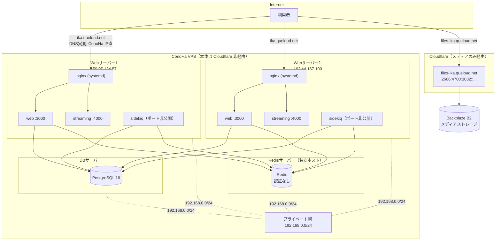

# イカトドン インフラ構成ドキュメント

このドキュメントは、イカトドン（`koba-lab/mastodon`、Mastodon のフォーク）のインフラと運用の
全体像を記録するものです。issue #876「Web サーバーへのデプロイを自動化したい」への対応を
きっかけに、インフラの全体像がドキュメントとして存在しないこと自体が根本の問題だと判明した
ため、まずこのドキュメントを整備します。

トピックごとに「今こうなっている → こうしたい」を並べる構成にしています。各節では
**「決定済み」の内容**と**「要件のみで解決策は実施時に検討する」内容**を明確に書き分けて
います。この区別が無いと、未定の項目を決定済みと誤読して実装してしまう事故が実際に起きた
ため、特に注意して区別してください。

事実には根拠を **実測 / 聞き取り / 未確認** の区分で併記します。未確認のものには ⚠️ を付けて
います。

---

## 1. 全体図



- 本体（`ika.queloud.net`）は Cloudflare を経由せず、ConoHa の IP がそのまま DNS に返る（実測）。
- メディア（`files-ika.queloud.net`）のみ Cloudflare 経由で Backblaze B2 に向いている（実測・
  聞き取り）。メディアは移管済みでこのドキュメントの対象外。
- 構成は **Web 2台・DB 1台・Redis 1台の計4台**。Redis は DB とは別の独立したホストで動いて
  いる（issue #876 の記載 + 実測。以前の版で Redis を DB サーバー内に描いていたのは誤り）。
- Web / DB / Redis はプライベート網 `192.168.0.0/24` で相互通信する（実測: nginx の
  `allow 192.168.0.0/24`、DB の `pg_hba.conf`）。

---

## 2. サーバー構成 / ネットワーク

### 2.1 確定した事実

| 項目                                 | 事実                                                                                                                                                                                             | 根拠                               |
| ------------------------------------ | ------------------------------------------------------------------------------------------------------------------------------------------------------------------------------------------------ | ---------------------------------- |
| Web サーバー                         | **2台**。`150.95.184.57` / `163.44.167.100`                                                                                                                                                      | DNS 実測                           |
| Cloudflare                           | 本体には噛んでいない（メディアのみ）                                                                                                                                                             | ConoHa の IP がそのまま DNS に返る |
| プライベート網                       | Web / DB / Redis が `192.168.0.0/24` に載っている                                                                                                                                                | 設定ファイル実測                   |
| メディア                             | Backblaze B2（`S3_ENABLED=true`、`S3_ALIAS_HOST=files-ika.queloud.net`）                                                                                                                         | `.env.production` 実測             |
| `public/system` のディスク上のデータ | オブジェクトストレージ移行前の**レガシー残骸**。参照されていない                                                                                                                                 | 聞き取り + `S3_ENABLED=true`       |
| 静的ファイル配信                     | **アプリ（イメージ内）が配信できる**。Dockerfile が `RAILS_SERVE_STATIC_FILES="true"` を設定（`Dockerfile:38,54`、`config/application.rb:89`）。`.env.production` に無くてもイメージ側の値が効く | 実測                               |
| **Elasticsearch**                    | **使っていない**（`.env.production` に設定なし）                                                                                                                                                 | 実測                               |
| **New Relic**                        | **OTEL でアプリのトレース・メトリクスを送信中**（`OTEL_EXPORTER_OTLP_ENDPOINT`）                                                                                                                 | 実測                               |
| **`ufw`**                            | **非アクティブ（無効）**                                                                                                                                                                         | 実測                               |
| **Redis の認証**                     | **無し**（`REDIS_PASSWORD` は空）。守っているのは nginx / ホスト側の `allow 192.168.0.0/24` のみ                                                                                                 | 聞き取り                           |
| `docker-compose.override.yml`        | 本家の `.gitignore` で除外（73行目）                                                                                                                                                             | 実測                               |
| `.env.production`                    | 同じく除外（28行目）。各ホストに手置きで、**バックアップ無し**                                                                                                                                   | 実測                               |
| バックアップ cron                    | **未確認**。playbook に定義があるだけで、その playbook は壊れている                                                                                                                              | —                                  |

### 2.2 `CLAUDE.md` との整合

`CLAUDE.md` にはこのドキュメントの検討中にリポジトリへ追加された運用ルールがあり、以下は
それとの整合を取った内容です。

- **ブランチ運用**: `ikatodon` がデフォルトブランチ（本番相当）、`master` は上流追随用。機能
  PR は `master` へ向ける。`master → ikatodon` の昇格 PR は `ikatodon-promote-pr.yml` が
  自動作成する
- **migration は `docker compose run --rm web` で実行する。`exec` は使わない**（稼働中の旧
  コンテナの中で実行され、新しいマイグレーションファイルが存在しないまま「何もせず成功」
  するため）。`up -d` の前後で `down` は不要
- **CI 必須チェックの制約**: `lint` という名前は `format-check` と `lint-*` の5本が同じジョブ
  名になっており区別できない。`paths` フィルタ付きのワークフロー（`lint-ruby` 等）は変更
  パスによっては実行されないため必須にしない。常に実行されるのは `test-ruby.yml` と
  `format-check.yml` の2本
- 上流追随手順にある「`docker-compose.yml` のイメージタグを3箇所更新する」という手順は、
  3.2節の変更（compose のテンプレート化）が実現すると不要になる。**`CLAUDE.md` 側の更新も
  別途必要**（本 PR の対象外、別 PR で対応する）

### 2.3 実測で否定された推測

以前の検討で立てた推測のうち、実測・聞き取りで誤りと判明したものを記録します。同じ誤りを
繰り返さないための記録です。

| 前言                                               | 実際                                                                   |
| -------------------------------------------------- | ---------------------------------------------------------------------- |
| Origin CA で Let's Encrypt を撤去できる            | Cloudflare が本体経路に居ないため不可                                  |
| `real_ip` 未設定で `geo $allow_ip` が壊れている    | 杞憂。`$remote_addr` は実クライアント IP                               |
| Cloudflare が1台停止時に他へ自動で振り替えてくれる | 経路に居ないため振り替えない。有料 Load Balancing は費用面で不採用済み |
| サーバー間通信に HTTPS が必要                      | 不要。プライベート網があるので平文 HTTP でよい                         |
| Web サーバーは4台                                  | 2台                                                                    |
| `public/` を消すと古い画像が壊れる                 | 誤り。移行前から既に別のオブジェクトストレージで配信していた           |
| 監視は Mackerel（DB のみ）だけ                     | 誤り。New Relic が既に稼働中（7節）                                    |

### 2.4 決定事項 — 構成方針

| 項目                                                             | 決定                      | 理由                                     |
| ---------------------------------------------------------------- | ------------------------- | ---------------------------------------- |
| 基本構成（ConoHa VPS / Docker Compose / 自前 PostgreSQL・Redis） | **維持**                  | 困りごとは構成ではなく記録の不在と属人化 |
| メディア                                                         | **対象外**（B2 移管済み） | いつでも移設できる体制がある             |
| DB / Redis のマネージド化                                        | **不採用**                | 料金。プライベート網の利点も失う         |
| Cloudflare 有料 Load Balancing                                   | **不採用**                | 有料。検討のうえ却下済み                 |

### 2.5 要件のみ（解決策は実施時に検討）— Cloudflare 化の判断（トラック C）

Web サーバー本体を Cloudflare 経由にするかどうかは **実施未定**（トラック C）。Origin CA
証明書（15年）を使えれば Let's Encrypt の更新の仕掛けが不要になるメリットはあるが、切り替
えるかどうか自体が未決定。

⚠️ **未確認**: そもそも現在 Cloudflare 経由にしていない理由が記録に残っていない。聞き取りが
必要（10節参照）。

---

## 3. アプリケーション（コンテナ、バージョン管理、ログ）

### 3.1 今の構成（実測）

- コンテナは `web` / `streaming` / `sidekiq` の3種類。
- `web` と `streaming` は `127.0.0.1` にのみバインドしている。**`sidekiq` はポートを公開して
  いない**ため、「3種類すべてが `127.0.0.1` にバインドしている」という言い方は不正確（この
  制約が当てはまるのは `web` と `streaming` のみ）。
- `docker-compose.override.yml` は本家の `.gitignore` で除外されている（73行目）。
- `.env.production` も同じく除外されている（28行目）。**各ホストに手置きで、バックアップが
  無い**（聞き取り + `.gitignore` 確認。詳細は6節）。

### 3.2 決定事項 — compose ファイルのテンプレート化

イメージタグの指定は `ikatodon/compose.override.yml.template` に移し、GitHub Actions が
`envsubst` でバージョンを埋め込んで各ホストへ配置する（5節参照）。`docker-compose.yml` は
**本家のまま**に戻す。これにより毎リリースごとに本家との差分がコンフリクトする問題が消える
（`CLAUDE.md` の「上流に手を入れない」方針にも合致する）。

```yaml
services:
  web:
    image: ghcr.io/koba-lab/ikatodon:${IKATODON_VERSION}
    ports: ['${PRIVATE_IP}:3000:3000']
    logging: { driver: json-file, options: { max-size: 50m, max-file: '3' } }
  streaming:
    image: ghcr.io/koba-lab/ikatodon-streaming:${IKATODON_VERSION}
    ports: ['${PRIVATE_IP}:4000:4000']
    logging: { driver: json-file, options: { max-size: 50m, max-file: '3' } }
  sidekiq:
    image: ghcr.io/koba-lab/ikatodon:${IKATODON_VERSION}
    logging: { driver: json-file, options: { max-size: 50m, max-file: '3' } }
```

- **`sidekiq` にもログ上限を入れる。** Docker の `json-file` ドライバは既定でログサイズが
  無制限で、現在の compose には上限指定が無い。`web` だけでなく `sidekiq` も大量にログを
  吐くため、放置するとディスクを食い潰す（既知の問題 #9、9節参照）。3サービスとも同じ
  上限を設定する
- `sidekiq` はポートを公開しない。ポート公開先はいずれも `192.168.0.0/24` の中だけで、DB /
  Redis と同じ信頼範囲に収まる
- ⚠️ **`envsubst` は置換対象の変数を明示的に絞って呼び出す必要がある**（セキュリティ上重要、
  Copilot 指摘）。変数指定なしで `envsubst` を実行すると、テンプレート内の `${PRIVATE_IP}`
  まで GHA 側の環境変数（通常は未設定＝空文字）で置換されてしまい、結果として
  `:3000:3000` のように**全インターフェースに公開され得る**。`envsubst '$IKATODON_VERSION'`
  のように置換する変数を限定し、`${PRIVATE_IP}` は GHA 側では一切触らずホスト上の
  `docker compose`（ホストの `.env` を参照）に展開させる

ホストの `.env`（Ansible が配布、秘密は含まない）:

```
PRIVATE_IP=192.168.0.<自分>
COMPOSE_FILE=docker-compose.yml:ikatodon/compose.override.yml
```

### 3.3 決定事項 — 構成管理（Ansible）

`ikatodon/ansible/` に、`ikatodon-db` と同じ流儀の Ansible playbook を置く。**エージェント
レス**で、サーバー側に必要なのは SSH と Python3 のみ（どちらも既存）。常駐プロセスは増えない。

管理対象: nginx 設定（テンプレート化。通常版 / drain 版の include を含む。4節参照）、ufw、
`.env` の非機密部分。

導入は **`--check --diff` の dry run で差分ゼロを確認してから適用する**。難所はツールでは
なく現状の設定を正確にテンプレートへ起こすことなので、`sudo nginx -T` で完全な現状を吸い
出してから作業する。

⚠️ nginx の Docker 化（`ikatodon-redis` と同じ方式）は **トラック C（Cloudflare 化の判断）
の後**に検討する。Ansible でテンプレート化した設定はそのまま `conf.d` に持っていけるので、
先に Ansible 化してもやり直しにはならない。

---

## 4. nginx

### 4.1 今の構成（実測）

- nginx はホストの systemd で動く。**Docker の外**。`user mastodon` で稼働。
- `acme-challenge` upstream に、現役でない IP が2つ残っている（既知の問題 #7）。

### 4.2 決定事項 — ゼロダウンタイムデプロイ

コンテナをプライベート IP にも公開し、nginx に「隣のサーバー」をバックアップ登録する。
**既存の `acme-challenge` upstream と同じパターン**を踏襲する。転送先は隣の nginx ではなく
**隣のアプリのポートを直接**指すのでループしない。プライベート網なので平文 HTTP で足りる。

```nginx
upstream mastodon_web {
  server 127.0.0.1:3000 max_fails=2 fail_timeout=5s;
  server 192.168.0.<隣>:3000 backup;
}
```

**`proxy_next_upstream` は POST を再送しない**ため、これだけでは投稿が失敗し得る。対策として
コンテナを止める前に **nginx から自分を外す（drain）**。Ansible が「通常版」「drain 版」両方
の include を配布し、**デプロイ時にシンボリックリンクを張り替えて reload** する（5節参照）。

**WebSocket（streaming）は再接続が発生する。** ここは構造上ゼロにできない。

⚠️ **決定事項 — 切替の可否判定は `/health` だけでは不十分。** `/health`
（`app/controllers/health_controller.rb:3-6`）は DB / Redis への接続確認を一切せず、常に
`OK` を返すだけのエンドポイントである。これを唯一の切替ゲートにすると、**DB / Redis に
接続できない壊れた新版でも「成功」扱いになり、2台とも壊れた版に切り替わってしまう**。
ゼロダウンタイムの前提そのものが崩れるため、nginx を復帰させる前に、`/health` に加えて
**DB / Redis への接続を伴う readiness チェック**（例: 実際に DB へクエリを投げるエンド
ポイント、または代表的なページの HTTP 200 確認）を行う必要がある。具体的な実装（新しい
readiness エンドポイントを追加するか、既存ページで代替するか）は実施時に検討する。

### 4.3 未確認事項

⚠️ `error_page ... /home/mastodon/live/public/500.html` は URI として `root` と二重連結
されている疑いがある（既知の問題 #12）。次回デプロイ中に画面で確認する必要がある。

⚠️ `nginx.conf` に `ssl_protocols TLSv1 TLSv1.1` が残っている疑いがある（既知の問題
#14）。`sudo nginx -T` で確認する。

---

## 5. デプロイ

### 5.1 現状の手順（聞き取り）

手動デプロイ。Web サーバー上で `git pull`（本体の checkout）を行っている。「本家で必要と
される追加コマンド」がどこにも記録されていない（既知の問題 #4）。post deployment
migration を「1台目だけ新しい」状態で実行してしまっている（既知の問題 #3）。

### 5.2 決定事項 — GitHub Actions がファイルを配信する（Web サーバーの git clone を廃止）

**Web サーバー上の git clone を廃止する。** clone は compose ファイルの配送手段でしか
なかったが、静的ファイルはイメージ内のアプリ自身が配信できる（3.1節・2.1節で確認済み）ため、
clone を維持する理由が無い。

```
GHA が envsubst で override（compose.override.yml）を生成
  → 対象バージョンのタグ（またはコミット）から本家の docker-compose.yml も取得
  → 両方を scp で2台へ配置  （appleboy/scp-action 等）
  → docker compose pull    （appleboy/ssh-action 等）
  → docker compose up -d
```

⚠️ **決定事項 — ベースの `docker-compose.yml` も override と一緒に配布する。**
git clone を廃止すると、override（イメージタグ）だけを配布してもホスト上の
`docker-compose.yml` はそのとき置いた版のまま固定されてしまう。本家が `command` /
`healthcheck` / ネットワーク設定などを変更しても、配布対象に入っていなければ新しい
イメージと同期せず、**Kamal を不採用にした理由（`deploy.yml` が compose と二重管理になり
本家の変更が伝播しない）と同じ不整合**が起きる。これを避けるため、`prepare` は
override だけでなく **対象バージョンのタグ時点の `docker-compose.yml` も同じタイミングで
取得・配布する**。ロールバック時もこの2ファイルを常に同じ版の組で戻す（5.2節のロール
バック手順、3.2節参照）。

**これでバージョン指定の問題が消える。** 入力値がそのままファイルに入る。`git pull` も
`git checkout` もデプロイから消える。整形は `sed` ではなく **`envsubst`** を使う。

⚠️ **`envsubst` はここでも置換対象の変数を `IKATODON_VERSION` だけに絞って呼び出す**
（3.2節参照）。絞らずに実行すると、テンプレート内の `${PRIVATE_IP}` が GHA 側の空の環境
変数で置換され `:3000:3000` のように全インターフェースへ公開されかねない。`PRIVATE_IP` は
GHA 側では触らず、ホスト上の `docker compose` がホストの `.env` から展開する。

#### 採用しなかった案と理由

同じ検討を繰り返さないための記録。

| 案                           | 不採用の理由                                                                                                                                                                                                                     |
| ---------------------------- | -------------------------------------------------------------------------------------------------------------------------------------------------------------------------------------------------------------------------------- |
| **Kamal**                    | `deploy.yml` が compose と二重管理になる。本家が `command` や `healthcheck` を変えても伝播せず静かに壊れる。ステージングが無く CI しか使えない環境では反映結果の検証がしにくい。**ステージングを用意できるなら再検討の価値あり** |
| **Docker Swarm**             | 2台間で `2377/tcp` `7946/tcp+udp` `4789/udp` を開ける必要があり、**VPS の制約で開けられない可能性**。compose にも複数の書き換えが要る                                                                                            |
| **Ansible をデプロイに使う** | Ansible は構成管理ツールでデプロイツールではない。切替もロールバックも自作になる                                                                                                                                                 |
| **Kubernetes / k3s**         | 2台構成に対して過大                                                                                                                                                                                                              |
| **git clone を維持する**     | 版指定の設計が別途必要になり、`public/` の更新への追従作業も残ってしまう                                                                                                                                                         |

#### ワークフロー構造（目指す形）

```
on: workflow_dispatch
  inputs: version（例 v4.6.5）, pause_before_post（既定 false）
concurrency: 本番デプロイで1本に限定    ← 必須。複数 dispatch の同時実行による競合を防ぐ

verify        PR 時の CI で担保済みの内容を再確認
prepare       各ホストで現在の compose.override.yml を compose.previous.yml として退避
                → 新しい compose ファイルを envsubst で生成して2台へ scp 配置
                → docker compose pull
pre-migrate   docker compose run --rm web env SKIP_POST_DEPLOYMENT_MIGRATIONS=true \
                bundle exec rails db:migrate        ← 新イメージから実行する。exec は使わない
deploy        matrix [host1, host2]、max-parallel: 1
                1. nginx を drain（自分を外して reload）
                2. docker compose up -d             ← down は不要
                3. /health に加え、DB/Redis 接続を伴う readiness チェックが通るまで待つ
                   （/health 単体では DB/Redis 未接続の壊れた新版も「成功」と誤判定する。4.2節）
                4. 失敗時: compose.previous.yml と対象タグ以前の docker-compose.yml を
                   両方元に戻して docker compose up -d（＝前のイメージで再起動）→ nginx を復帰
                5. 成功時: nginx を復帰（reload）
gate          if: inputs.pause_before_post → Environments の承認待ち（追加コマンドを流す）
post-migrate  docker compose run --rm web bundle exec rails db:migrate
```

- **`version` の入力値は override テンプレートの `${IKATODON_VERSION}` に補間される。**
  prepare ジョブは対象バージョンの compose ファイルを生成・配置するところまでを担い、
  ホスト側で `git pull` して版を合わせるような手順は取らない
- **自動ロールバックには「上書き前の compose ファイル」の退避が必須。** prepare が
  compose.override.yml を新バージョンで上書きしてしまうため、単に `docker compose up -d`
  を再実行しても「前のイメージ」を指せない。prepare のタイミングで稼働中の
  compose ファイル（またはバージョン文字列）を `compose.previous.yml` として退避しておき、
  ヘルスチェック失敗時にそれを `compose.override.yml` として再配置してから
  `docker compose up -d` する
- **workflow-level の `concurrency` グループを必須とする。** `max-parallel: 1` は同一 run
  内の matrix を直列化するだけで、複数の `workflow_dispatch` が同時に始まった場合の drain・
  migration・デプロイの競合は防げない
- **バックアップのジョブは持たない**（トラック B の PITR で対応。6節参照）
- **post migration が全台更新後に走る**（現状の問題 #3 の修正）
- migration の有無は GHA 側で
  `git diff --name-only <稼働中> <対象> -- db/migrate db/post_migrate` で判定し、空なら
  pre/post ごとスキップできる

#### 決定事項 — ロールバックは層ごとに分ける

| いつ                                                                     | 動作                                                                                                                                                                                                                                                                                         |
| ------------------------------------------------------------------------ | -------------------------------------------------------------------------------------------------------------------------------------------------------------------------------------------------------------------------------------------------------------------------------------------- |
| **readiness チェックが通らない**（`/health` + DB/Redis 接続確認。4.2節） | **自動。** 退避しておいた `compose.previous.yml` と対象タグ以前の `docker-compose.yml` を再配置し、前のイメージで起動し直してから nginx を戻す。1台目で失敗すれば2台目へは進まない。サイトは終始生きている                                                                                   |
| **migration が失敗**                                                     | 自動で中断。コンテナは入れ替えていないためサービスは継続するが、**`db:migrate` は複数の migration を順に確定していき `disable_ddl_transaction!` を使うものもあるため、DB が部分的に更新されている可能性がある**。「影響なし」ではない。DB 状態を確認し手動復旧するまで次のステップに進まない |
| **post migration が失敗**                                                | **自動では戻さない。** 両台とも新版で DB が中途半端な状態。デプロイを止めて通知する                                                                                                                                                                                                          |
| **公開後に不具合が判明（post migration 実行前）**                        | 手動。前の `version` を入力して再実行する。**DB は戻らない**（トラック B の PITR が保険）                                                                                                                                                                                                    |
| **公開後に不具合が判明（post migration 実行後）**                        | ⚠️ **単純なアプリロールバックは安全ではない。** `db/post_migrate` にはカラム・テーブルを削除する migration が含まれるため、旧コードに戻すと既に削除されたスキーマへアクセスして起動後に壊れる。**forward fix（前進での修正）** か、**DB の復元（トラック B の PITR）を伴う手順**が必要       |

#### 検証の分担

| どこ           | 何を                                                                       | 何を確認していないか                                                                                                                                                                                                      |
| -------------- | -------------------------------------------------------------------------- | ------------------------------------------------------------------------------------------------------------------------------------------------------------------------------------------------------------------------- |
| PR 時の CI     | 生成した compose の構文検証。イメージが定義どおり起動し `/health` を返すか | ホスト固有値（`PRIVATE_IP` 等）が無いので**不完全**。また `/health` は DB/Redis 接続を確認しないため、readiness チェック（4.2節）としての正しさは別途デプロイ時に確認する                                                 |
| prepare ジョブ | 配置した compose ファイルの構文検証（`compose config -q`）                 | **「100%」とは書かない。** これは構成（構文・変数展開結果）の検証であって、ホスト IP に実際に bind できるか、ポートが空いているか、コンテナが起動して readiness チェックを通過するかは別途 preflight で確認する必要がある |

### 5.3 GHA からサーバーへの ssh 経路 — ⚠️ 未確認（要確認事項）

以前「`ufw` が無効なので解消済み」と記載していたが、これは撤回する。**`ufw` が無効である
ことは、GitHub-hosted runner から実際に SSH できることを保証しない。** ConoHa 側のファイア
ウォール、nftables/iptables、`sshd` の `Match Address` など、`ufw` とは別の制限が存在する
可能性がある。

⚠️ **未確認**: `ufw` は無効だが、実際に GitHub Actions の runner から 22/tcp への到達性と
鍵認証が通るかどうかは確認できていない。10節の確認事項として扱う。

**セルフホストランナーは採用しない。** このフォークはパブリックリポジトリで、フォークからの
PR で任意コードがサーバー上で実行され得る既知の問題があるため。

---

## 6. バックアップと復旧

### 6.1 現状（実測・聞き取り）

- バックアップ cron は **未確認**。`ikatodon-db` の playbook に定義があるだけで、その
  playbook（`deploy-postgres.yml`）は存在しない `docker-compose.postgres16.yml` を参照して
  おり**実行できない**（既知の問題 #1）。
- `restore.sh` が対話式で、緊急時に自動実行できない（既知の問題 #5）。
- `.env.production` にバックアップが無い（既知の問題 #11。下記 6.3 参照）。

### 6.2 決定事項 — PITR（トラック B）

用途は migration の保険。**保持は24〜48時間で十分**、優先するのは**復旧点の細かさ**、
**コストは抑える**（参照しないファイルへの固定費は高い）。

- フルダンプの高頻度化は**保管費用が用途に見合わない**ため採らない
- **WAL アーカイブ + ベースバックアップの両方が必要。** WAL アーカイブだけでは PITR できない
  ——復元の起点となるベースバックアップと、それ以降の連続した WAL の両方が揃って初めて任意
  時点への復旧ができる。24〜48時間の復旧窓を実現するため、ベースバックアップの取得頻度と
  保持方針も要件に含める
- 実装は自作しない。**wal-g** か **pgBackRest** を使う。B2 は S3 互換 API を持つ
- ⚠️ **アーカイブが失敗し続けると `pg_wal` が溜まってディスクを埋め、PostgreSQL が停止する**
  （監視の必須項目、7節参照）
- ⚠️ `postgres:16` 公式イメージに wal-g は入っていない。独自イメージか別コンテナが要る

先に測るべき値（10節の確認コマンドも参照）:

```bash
docker exec mastodon_postgres16 du -sh /var/lib/postgresql/data/pg_wal   # PGDATA は postgres UID 所有・0700 のためコンテナ内から確認する
docker exec mastodon_postgres16 psql -U mastodon -d mastodon_production \
  -c "SELECT * FROM pg_stat_archiver;"
time /opt/mastodon/backup.sh   # 10分前後の見込み
```

### 6.3 決定事項 — 鍵の管理（鍵ごとに喪失影響が異なる）

**`.env.production` 内の各鍵は、失ったときの影響が鍵ごとに異なる。** 一律に「DB バックアップ
だけでは復旧できない」とまとめると復旧要件を誤るため、鍵ごとに分けて記載する。

| 鍵                           | 失うと                                                                                                                                                                                                                    | 再生成の可否                               |
| ---------------------------- | ------------------------------------------------------------------------------------------------------------------------------------------------------------------------------------------------------------------------- | ------------------------------------------ |
| `ACTIVE_RECORD_ENCRYPTION_*` | **DB の暗号化カラムが復号不能になる。DB のバックアップがあっても復旧できない**                                                                                                                                            | 不可                                       |
| `SECRET_KEY_BASE`            | 全セッションが無効化される。署名済み Cookie が壊れる                                                                                                                                                                      | 再生成すると影響が発生するが致命的ではない |
| `OTP_SECRET`                 | **移行後の DB では影響なし。** 旧形式 2FA 秘密を移行する post-migration でのみ参照される（`db/post_migrate/20240307180905_migrate_devise_two_factor_secrets.rb:82-115`）。移行済みであれば失っても既存 2FA には影響しない | 移行時にのみ必要                           |
| `VAPID_PRIVATE_KEY`          | **再生成可能。** 既存の push 購読が無効になるだけで、暗号化カラムの復号とは無関係                                                                                                                                         | 可                                         |
| `AWS_SECRET_ACCESS_KEY`      | 再発行可能                                                                                                                                                                                                                | 可                                         |

PITR を整えても、`ACTIVE_RECORD_ENCRYPTION_*` のような復号不能系の鍵が失われれば意味が
半減する点に変わりはない。

保管方針:

- 保管は **koba-lab さん個人の保管庫**（Google Drive / Notion / パスワードマネージャ）
- **LastPass は避ける** — 2022年に暗号化 Vault のバックアップが流出した事案がある
- Google Drive / Notion は**平文で置きがち**。暗号化してから、2FA 必須
- **2箇所以上に置く**（片方はオフラインでもよいという想定）

### 6.4 あわせて直す既知の問題

- `restore.sh` の非対話モード対応（#5）
- `deploy-postgres.yml` の参照ファイル名の修正（#1）
- `PRIVATE_IP` のデフォルトが `0.0.0.0` になっている点の廃止（#2。抜けると PostgreSQL が
  全世界に公開されてしまう）

---

## 7. 監視

### 7.1 現状（実測・聞き取り）

- **New Relic が既にアプリのトレース・メトリクスを OTEL 経由で受けている**（実測）。
- Mackerel は DB サーバーに導入済み。Web サーバー側の Mackerel 監視の有無は ⚠️ **未確認**
  （聞き取りが必要。10節参照）。

### 7.2 決定事項 — New Relic と Mackerel の併用

役割を分けて併用する。

|               | 担当                                                       |
| ------------- | ---------------------------------------------------------- |
| **New Relic** | アプリのトレース、性能（レスポンスタイム、キュー滞留など） |
| **Mackerel**  | サーバーのメトリクス、外形監視                             |

**アラートの通知先は一本化する。**

外形監視に加えて次の4項目を監視する:

| 対象                         | 理由                                                            |
| ---------------------------- | --------------------------------------------------------------- |
| **ディスク残量**             | PITR で `pg_wal` が溜まって DB 停止する事故が現実的になる。必須 |
| **証明書の期限**             | 自動更新が壊れても切れるまで気づけない                          |
| **デプロイの失敗**           | GitHub Actions の通知で足りる。追加コストなし                   |
| **CPU / ネットワークの異常** | マイニング検知を兼ねる                                          |

**入れないもの**: レスポンスタイム、キュー滞留。これらは New Relic 側で見られるため重複して
監視しない。**障害対応の手順書は作らない。** まずは「止まったことに気づける」状態を作ること
を優先する。

Mackerel を **Web 2台にも入れる**（現在 DB のみ）。⚠️ 無料枠のホスト数は未確認。

### 7.3 見つけた穴（8節のセキュリティとも関連）

`ikatodon-db/docker-compose.yml` の mackerel-agent が `/var/run/docker.sock:ro` を
マウントしている。**`:ro` はほぼ無意味**で、このソケットに触れれば任意のコンテナを特権起動
できる。**agent が乗っ取られれば実質ホストの root** を取られる。Web 2台にも Mackerel を
入れるなら同じ構成が増えることになるため、判断が要る（既知の問題 #10）。

---

## 8. セキュリティ

**このセクションは要件のみを定めるものであり、具体的な解決策（ツール・実装）は未定です。
実施のタイミングで改めて選定します。** 理想像には含めますが、以下を「決定済み」と誤読しない
でください。

### 8.1 要件

- 侵害されていないかを確認できる（永続化・バックドアの設置に気づける）
- マイニングに使われていないかを確認できる
- 予防側を固める（パッチ適用、鍵の権限、SSH は鍵のみ、Docker ソケットの扱い）

### 8.2 候補として挙がったもの（未選定）

- AIDE によるファイル改ざん検知
- CrowdSec
- Mackerel の CPU / ネットワーク監視（7節と兼用）

**Wazuh は1人運用には重いと判断し、候補から外している**（ただし正式な不採用決定ではなく、
検討の結果として重いと分かっている、という位置づけ）。

### 8.3 実現が難しいと分かっているもの（過度な期待をしないための記録）

- **「変なところと通信していないか」の検知** — ActivityPub は不特定多数へ能動的に HTTP
  リクエストを出すのが正常動作であるため、宛先ベースの異常検知は誤検知の海になり実用に
  ならない
- **「情報が漏れた/盗まれたか」の検知** — 正規のアクセスと不正アクセスを区別する手段が
  無い。検知より予防（8.1）への投資の方が費用対効果で勝ると考えている

### 8.4 見つけている穴

| 穴                                     | 内容                                                                                                                                                                                                                                                                                                    |
| -------------------------------------- | ------------------------------------------------------------------------------------------------------------------------------------------------------------------------------------------------------------------------------------------------------------------------------------------------------- |
| **`ufw` が無効**                       | **公開インターフェースに bind / publish されているサービスに限り**、ufw による防御がない状態（`127.0.0.1` にのみバインドしている web / streaming は対象外。3.1節参照）。なお、コンテナの公開ポートは元々 ufw を迂回する性質があるため、`ufw` を有効化しても Docker の `ports:` 公開自体は別途対処が要る |
| **Redis に認証が無い**                 | 守っているのは nginx / ホスト側の `allow 192.168.0.0/24` のみ。防御が1枚しかない                                                                                                                                                                                                                        |
| **Docker ソケットのマウント**          | mackerel-agent が `/var/run/docker.sock:ro` をマウントしている（7.3節）。`:ro` はほぼ無意味で、乗っ取られれば実質ホストの root。Web 2台に入れると同じ構成が増える                                                                                                                                       |
| `.env.production` にバックアップが無い | 6.3節参照                                                                                                                                                                                                                                                                                               |

---

## 9. 既知の問題

### 9.1 確認済み

| #   | 問題                                                                                                        |
| --- | ----------------------------------------------------------------------------------------------------------- |
| 1   | `ikatodon-db/deploy-postgres.yml` が存在しない `docker-compose.postgres16.yml` を参照している。実行できない |
| 2   | 同 compose の `PRIVATE_IP` デフォルトが `0.0.0.0`。設定を抜くと PostgreSQL が全世界に開く                   |
| 3   | post deployment migration を「1台目だけ新しい」状態で実行している                                           |
| 4   | 「本家で必要とされる追加コマンド」がどこにも記録されていない                                                |
| 5   | `restore.sh` が対話式で緊急時に自動実行できない                                                             |
| 6   | Ansible の `docker_compose` モジュールは非推奨                                                              |
| 7   | `acme-challenge` upstream に現役でない IP が2つ残っている                                                   |
| 8   | イメージタグを本家の `docker-compose.yml` に直接書いており毎リリース衝突する                                |
| 9   | Docker の `json-file` ログに上限指定が無い                                                                  |
| 10  | `ufw` が無効 / Redis に認証が無い / Docker ソケットのマウント（7.3、8.4）                                   |
| 11  | `.env.production` にバックアップが無い（6.3）                                                               |

### 9.2 要確認

| #   | 疑い                                                                                       | 確認方法                                    |
| --- | ------------------------------------------------------------------------------------------ | ------------------------------------------- |
| 12  | `error_page ... /home/mastodon/live/public/500.html` が URI として `root` と二重連結される | 次回デプロイ中に画面を見る                  |
| 13  | 全台で同じ `bundle exec sidekiq` が動いていると `scheduler` が多重実行される可能性         | 稼働中コンテナの command を直接確認（10節） |
| 14  | `nginx.conf` に `ssl_protocols TLSv1 TLSv1.1` が残る                                       | `sudo nginx -T`                             |
| 15  | Redis の nginx が `ports: 6379:6379` で公開。Docker の publish は ufw を迂回し得る         | `sudo ufw status`、外部からの疎通確認       |

---

## 10. 未確認事項と確認コマンド

以下のコマンドの結果を貼れば、後続の作業（Ansible テンプレート化、デプロイ自動化の実装
など）に進めます。

```bash
sudo nginx -T                                     # Ansible テンプレート化の元データ
ip -4 addr                                        # 各 Web サーバーのプライベート IP
sudo crontab -l -u mastodon                       # バックアップ cron が本当にあるか（-u は root 権限が必要）
ls -la /opt/mastodon/backups/
docker exec mastodon_postgres16 du -sh /var/lib/postgresql/data/pg_wal   # PGDATA はホストから直接走査できないためコンテナ内で確認
docker exec mastodon_postgres16 psql -U mastodon -d mastodon_production \
  -c "SELECT * FROM pg_stat_archiver;"
time /opt/mastodon/backup.sh                      # 10分前後の見込み
docker inspect --format '{{.Config.Cmd}}' <sidekiq コンテナ名>   # scheduler 重複（#13）
# GHA runner からの ssh 到達性（5.3節）。GitHub-hosted runner の IP レンジから
# 22/tcp への到達性と鍵認証が通るかは、実際に workflow から接続して確認する必要がある
```

> ⚠️ **`docker compose config` はここでは使わない。** `env_file` の内容を解決して出力するため、
> 結果を貼ると `.env.production` の秘密値が混ざって公開先に漏洩し得る（Copilot 指摘）。
> sidekiq の `scheduler` 重複確認には、稼働中コンテナの command だけを直接見る
> `docker inspect` を使う。
>
> Elasticsearch の使用有無は 2.1節の実測で「使っていない」と確定済みのため、ここでの
> 再確認コマンドは不要（以前の版にあった `grep ES_ENABLED` 系のコマンドは削除した）。

### 聞き取りが必要なもの

| 項目                                               | なぜ必要か                        |
| -------------------------------------------------- | --------------------------------- |
| Web サーバー側の Mackerel 監視の有無               | 7節の前提                         |
| **Web サーバーを Cloudflare 経由にしていない理由** | 記録が無い。トラック C の判断材料 |

---

## 付録: ロードマップ

| 段階 | 内容                                                         | 依存 |
| ---- | ------------------------------------------------------------ | ---- |
| 0    | 10節の未確認事項を埋める                                     | —    |
| 1    | 危険な既知問題の修正（#1 #2 #9 #10 #11）                     | 0    |
| 2    | Ansible で nginx / ufw / compose override を構成管理下に置く | 0    |
| 3    | デプロイ自動化（issue #876 本体）                            | 2    |
| 4    | PITR（3 と並行可）                                           | 0    |
| 5    | 監視の拡張（7節）                                            | 0    |
| 6    | セキュリティ（要件から解決策を選定、8節）                    | 5    |
| 7    | Cloudflare 化の判断（トラック C）                            | 独立 |
| 8    | nginx の Docker 化                                           | 7    |
