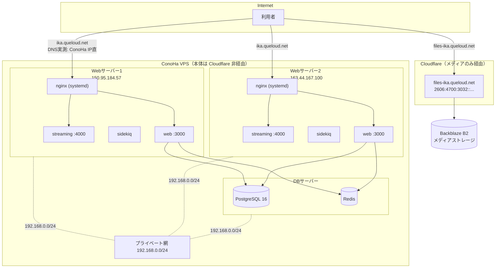

# イカトドン インフラ構成ドキュメント

このドキュメントは、イカトドン（`koba-lab/mastodon`、Mastodon のフォーク）のインフラと運用の
全体像を記録するものです。issue #876「Web サーバーへのデプロイを自動化したい」への対応を
きっかけに、インフラの全体像がドキュメントとして存在しないこと自体が根本の問題だと判明した
ため、まずこのドキュメントを整備します。

トピックごとに「今こうなっている → こうしたい」を並べる構成にしています。各節では
**「決定済み」の内容**と**「要件のみで解決策は実施時に検討する」内容**を明確に書き分けて
います。この区別が無いと、未定の項目を決定済みと誤読して実装してしまう事故が実際に起きた
ため、特に注意して区別してください。

事実には根拠を **実測 / 聞き取り / 未確認** の区分で併記します。未確認のものには ⚠️ を付けて
います。

---

## 1. 全体図



- 本体（`ika.queloud.net`）は Cloudflare を経由せず、ConoHa の IP がそのまま DNS に返る（実測）。
- メディア（`files-ika.queloud.net`）のみ Cloudflare 経由で Backblaze B2 に向いている（実測・
  聞き取り）。メディアは移管済みでこのドキュメントの対象外。
- Web / DB はプライベート網 `192.168.0.0/24` で相互通信する（実測: `ikatodon-redis` の
  `allow 192.168.0.0/24`、`ikatodon-db` の `pg_hba.conf`）。

---

## 2. サーバー構成 / ネットワーク

### 2.1 今わかっていること（実測・聞き取り）

| 項目                | 事実                                                  | 根拠                                             |
| ------------------- | ----------------------------------------------------- | ------------------------------------------------ |
| Web サーバー        | **2台**。`150.95.184.57` / `163.44.167.100`           | DNS 実測 + 聞き取り                              |
| nginx に残る古い IP | `150.95.138.129` / `133.130.122.196` は古い IP の残骸 | 設定ファイル確認                                 |
| Cloudflare          | 本体には噛んでいない（メディアのみ）                  | ConoHa の IP がそのまま DNS に返る               |
| プライベート網      | Web も DB も `192.168.0.0/24` に載っている            | `ikatodon-redis` の `allow`、DB の `pg_hba.conf` |
| サーバー間通信      | HTTPS 不要。プライベート網があるので平文 HTTP でよい  | 決定事項（下記参照）                             |

### 2.2 実測で否定された推測

以前の検討で立てた推測のうち、実測で誤りと判明したものを記録します。同じ誤りを繰り返さない
ための記録です。

| 前言                                               | 実際                                                                   |
| -------------------------------------------------- | ---------------------------------------------------------------------- |
| Origin CA で Let's Encrypt を撤去できる            | Cloudflare が本体経路に居ないため不可                                  |
| `real_ip` 未設定で `geo $allow_ip` が壊れている    | 杞憂。`$remote_addr` は実クライアント IP                               |
| Cloudflare が1台停止時に他へ自動で振り替えてくれる | 経路に居ないため振り替えない。有料 Load Balancing は費用面で不採用済み |
| サーバー間通信に HTTPS が必要                      | 不要。プライベート網があるので平文 HTTP でよい                         |
| Web サーバーは4台                                  | 2台                                                                    |

### 2.3 決定事項 — 構成方針

| 項目                                                             | 決定                      | 理由                                     |
| ---------------------------------------------------------------- | ------------------------- | ---------------------------------------- |
| 基本構成（ConoHa VPS / Docker Compose / 自前 PostgreSQL・Redis） | **維持**                  | 困りごとは構成ではなく記録の不在と属人化 |
| メディア                                                         | **対象外**（B2 移管済み） | いつでも移設できる体制がある             |
| DB / Redis のマネージド化                                        | **不採用**                | 料金。プライベート網の利点も失う         |
| Cloudflare 有料 Load Balancing                                   | **不採用**                | 有料。検討のうえ却下済み                 |

### 2.4 要件のみ（解決策は実施時に検討）— Cloudflare 化の判断（トラック C）

Web サーバー本体を Cloudflare 経由にするかどうかは **実施未定**（トラック C）。Origin CA
証明書（15年）を使えれば Let's Encrypt の更新の仕掛けが不要になるメリットはあるが、切り替え
るかどうか自体が未決定。

⚠️ **未確認**: そもそも現在 Cloudflare 経由にしていない理由が記録に残っていない。聞き取りが
必要（10節参照）。

---

## 3. アプリケーション（コンテナ、バージョン管理、ログ）

### 3.1 今の構成（実測）

- コンテナは `web` / `streaming` / `sidekiq` の3種類。
- いずれも `127.0.0.1` にのみバインドしている（`docker-compose.yml` 実測）。
- `docker-compose.override.yml` は本家の `.gitignore` で除外されている（73行目）。
- `.env.production` も同じく除外されている（28行目）。**各ホストに手置きで、バックアップが
  無い**（聞き取り + `.gitignore` 確認。詳細は6節）。

### 3.2 決定事項 — イメージタグと compose の分離

イメージタグの指定は `ikatodon/compose.override.yml` に移し、`docker-compose.yml` は
**本家のまま**に戻す。これにより毎リリースごとに本家との差分がコンフリクトする問題が消える。

```yaml
services:
  web:
    image: ghcr.io/koba-lab/ikatodon:v4.6.5
    ports: ['${PRIVATE_IP}:3000:3000']
    logging: { driver: json-file, options: { max-size: 50m, max-file: '3' } }
  streaming:
    image: ghcr.io/koba-lab/ikatodon-streaming:v4.6.5
    ports: ['${PRIVATE_IP}:4000:4000']
  sidekiq:
    image: ghcr.io/koba-lab/ikatodon:v4.6.5
```

ホストの `.env`（Ansible が配布、秘密は含まない）:

```
PRIVATE_IP=192.168.0.<自分>
COMPOSE_FILE=docker-compose.yml:ikatodon/compose.override.yml
```

**ログ上限は必須の決定事項。** Docker の `json-file` ドライバは既定でログサイズが無制限で、
現在の compose には上限指定が無い。`web` / `sidekiq` は大量にログを吐くため、放置すると
ディスクを食い潰す（既知の問題 #9、9節参照）。

### 3.3 決定事項 — 構成管理（Ansible）

`ikatodon/ansible/` に、`ikatodon-db` と同じ流儀の Ansible playbook を置く。**エージェント
レス**で、サーバー側に必要なのは SSH と Python3 のみ（どちらも既存）。常駐プロセスは増えない。

管理対象: nginx 設定（テンプレート化。通常版 / drain 版の include を含む。5節参照）、
`compose.override.yml`、`.env`、ufw。

導入は **`--check --diff` の dry run で差分ゼロを確認してから適用する**。難所はツールでは
なく現状の設定を正確にテンプレートへ起こすことなので、`sudo nginx -T` で完全な現状を吸い
出してから作業する。

⚠️ nginx の Docker 化（`ikatodon-redis` と同じ方式）は **トラック C（Cloudflare 化の判断）
の後**に検討する。Ansible でテンプレート化した設定はそのまま `conf.d` に持っていけるので、
先に Ansible 化してもやり直しにはならない。

---

## 4. nginx

### 4.1 今の構成（実測）

- nginx はホストの systemd で動く。**Docker の外**。`user mastodon` で稼働。
- `acme-challenge` upstream に、現役でない IP が2つ残っている（既知の問題 #7）。

### 4.2 決定事項 — ゼロダウンタイムデプロイ

コンテナをプライベート IP にも公開し、nginx に「隣のサーバー」をバックアップ登録する。
**既存の `acme-challenge` upstream と同じパターン**を踏襲する。転送先は隣の nginx ではなく
**隣のアプリのポートを直接**指すのでループしない。プライベート網なので平文 HTTP で足りる。

```nginx
upstream mastodon_web {
  server 127.0.0.1:3000 max_fails=2 fail_timeout=5s;
  server 192.168.0.<隣>:3000 backup;
}
```

**`proxy_next_upstream` は POST を再送しない**ため、これだけでは投稿が失敗し得る。対策として
コンテナを止める前に **nginx から自分を外す（drain）**。Ansible が「通常版」「drain 版」両方
の include を配布し、**デプロイ時にシンボリックリンクを張り替えて reload** する（5節参照）。

**WebSocket（streaming）は再接続が発生する。** ここは構造上ゼロにできない。

### 4.3 未確認事項

⚠️ `error_page ... /home/mastodon/live/public/500.html` は URI として `root` と二重連結
されている疑いがある（既知の問題 #12）。次回デプロイ中に画面で確認する必要がある。

⚠️ `nginx.conf` に `ssl_protocols TLSv1 TLSv1.1` が残っている疑いがある（既知の問題
#14）。`sudo nginx -T` で確認する。

---

## 5. デプロイ

### 5.1 現状の手順（聞き取り）

手動デプロイ。「本家で必要とされる追加コマンド」がどこにも記録されていない（既知の問題
#4）。post deployment migration を「1台目だけ新しい」状態で実行してしまっている（既知の
問題 #3）。

### 5.2 決定事項 — GitHub Actions + ssh

`workflow_dispatch` + OSS の ssh アクション（`appleboy/ssh-action` 等）を使う。**新しく増える
運用対象がゼロ**で、既存の nginx・compose・GitHub Actions で完結する。

#### 採用しなかった案と理由

同じ検討を繰り返さないための記録。

| 案                           | 不採用の理由                                                                                                                                                                                                                                  |
| ---------------------------- | --------------------------------------------------------------------------------------------------------------------------------------------------------------------------------------------------------------------------------------------- |
| **Kamal**                    | `deploy.yml` が `docker-compose.yml` と二重管理になる。本家が `command` や `healthcheck` を変えても伝播せず静かに壊れる。ステージングが無く CI しか使えない環境では反映結果の検証がしにくい。**ステージングを用意できるなら再検討の価値あり** |
| **Docker Swarm**             | 2台間で `2377/tcp` `7946/tcp+udp` `4789/udp` を開ける必要があり、**VPS の制約で開けられない可能性**。compose にも複数の書き換えが要る                                                                                                         |
| **Ansible をデプロイに使う** | Ansible は構成管理ツールでデプロイツールではない。切替もロールバックも自作になる                                                                                                                                                              |
| **Kubernetes / k3s**         | 2台構成に対して過大                                                                                                                                                                                                                           |

#### ワークフロー構造（目指す形）

```
verify        PR 時の CI で担保済みの内容を再確認
prepare       両ホストで git pull → docker login → compose pull → compose config -q
pre-migrate   host1 で SKIP_POST_DEPLOYMENT_MIGRATIONS=true rails db:migrate
deploy        matrix [host1, host2]、max-parallel: 1
                1. nginx を drain（自分を外して reload）
                2. docker compose up -d
                3. /health が通るまで待つ
                4. nginx を復帰（reload）
gate          if: inputs.pause_before_post → Environments の承認待ち（追加コマンドを流す）
post-migrate  host1 で rails db:migrate（post 含む）
```

- 入力は `version` と `pause_before_post`（既定 false）
- **バックアップのジョブは持たない**（トラック B の PITR で対応。6節参照）
- **post migration が全台更新後に走る**（現状の問題 #3 の修正）
- migration の有無は `git diff --name-only <稼働中> <対象> -- db/migrate db/post_migrate` で
  判定し、空なら pre/post ごとスキップできる
- ロールバックは前のタグで再実行。**DB は戻らない**（トラック B が保険になる）

#### 検証の分担

| どこ           | 何を                                                                                  | 100%か                           |
| -------------- | ------------------------------------------------------------------------------------- | -------------------------------- |
| PR 時の CI     | override とマージ後の `compose config`。イメージが定義どおり起動し `/health` を返すか | ホスト固有値が無いので**不完全** |
| prepare ジョブ | ホスト上で `compose config -q`                                                        | ここで**100%**                   |

### 5.3 唯一の未解決論点 — GHA からサーバーへの ssh 経路

⚠️ **未確認**: `sudo ufw status` の結果で分岐する。

- SSH に IP 制限あり → GitHub Actions の IP レンジは広すぎるので別経路（Tailscale 等）が要る
- 制限なし → デプロイ鍵を1つ足すだけ。攻撃面はほぼ増えない

**セルフホストランナーは採用しない。** このフォークはパブリックリポジトリで、フォークからの
PR で任意コードがサーバー上で実行され得る既知の問題があるため。

---

## 6. バックアップと復旧

### 6.1 現状（実測・聞き取り）

- バックアップ cron は **未確認**。`ikatodon-db` の playbook に定義があるだけで、その
  playbook（`deploy-postgres.yml`）は存在しない `docker-compose.postgres16.yml` を参照して
  おり**実行できない**（既知の問題 #1）。
- `restore.sh` が対話式で、緊急時に自動実行できない（既知の問題 #5）。
- `.env.production` にバックアップが無い（既知の問題 #11。下記 6.3 参照）。

### 6.2 決定事項 — PITR（トラック B）

用途は migration の保険。**保持は24〜48時間で十分**、優先するのは**復旧点の細かさ**、
**コストは抑える**（参照しないファイルへの固定費は高い）。

- フルダンプの高頻度化は**保管費用が用途に見合わない**ため採らない
- **WAL アーカイブ**なら差分のみで、任意の秒に戻せる
- 実装は自作しない。**wal-g** か **pgBackRest** を使う。B2 は S3 互換 API を持つ
- ⚠️ **アーカイブが失敗し続けると `pg_wal` が溜まってディスクを埋め、PostgreSQL が停止する**
  （監視の必須項目、7節参照）
- ⚠️ `postgres:16` 公式イメージに wal-g は入っていない。独自イメージか別コンテナが要る

先に測るべき値（10節の確認コマンドも参照）:

```bash
du -sh /var/lib/postgresql/16/data/pg_wal
docker exec mastodon_postgres16 psql -U mastodon -d mastodon_production \
  -c "SELECT * FROM pg_stat_archiver;"
time /opt/mastodon/backup.sh   # 10分前後の見込み
```

### 6.3 決定事項 — 鍵の管理（DB バックアップだけでは復旧できない）

**重要な事実**: `.env.production` の `SECRET_KEY_BASE` / `ACTIVE_RECORD_ENCRYPTION_*` /
`VAPID_PRIVATE_KEY` を失うと、**DB のバックアップがあっても復旧できない**（暗号化カラムが
復号不能になる）。PITR を整えてもこの1ファイルが失われればその意味が半減する。

保管方針:

- 保管は **koba-lab さん個人の保管庫**（Google Drive / Notion / パスワードマネージャ）
- **LastPass は避ける** — 2022年に暗号化 Vault のバックアップが流出した事案がある
- Google Drive / Notion は**平文で置きがち**。暗号化してから、2FA 必須
- **2箇所以上に置く**（片方はオフラインでもよいという想定）

### 6.4 あわせて直す既知の問題

- `restore.sh` の非対話モード対応（#5）
- `deploy-postgres.yml` の参照ファイル名の修正（#1）
- `PRIVATE_IP` のデフォルトが `0.0.0.0` になっている点の廃止（#2。抜けると PostgreSQL が
  全世界に公開されてしまう）

---

## 7. 監視

### 7.1 現状（聞き取り）

Mackerel を DB サーバーには導入済み。Web サーバー側の Mackerel 監視の有無は ⚠️ **未確認**
（聞き取りが必要。10節参照）。

### 7.2 決定事項

**Mackerel の外形監視で障害検知する。障害対応の手順書は作らない。**

加えて次の4項目を監視する:

| 対象                         | 理由                                                            |
| ---------------------------- | --------------------------------------------------------------- |
| **ディスク残量**             | PITR で `pg_wal` が溜まって DB 停止する事故が現実的になる。必須 |
| **証明書の期限**             | 自動更新が壊れても切れるまで気づけない                          |
| **デプロイの失敗**           | GitHub Actions の通知で足りる。追加コストなし                   |
| **CPU / ネットワークの異常** | マイニング検知を兼ねる                                          |

**入れないもの**: レスポンスタイム、キュー滞留。まずは「止まったことに気づける」状態を作る
ことを優先する。

Mackerel を **Web 2台にも入れる**（現在 DB のみ）。⚠️ 無料枠のホスト数は未確認。

### 7.3 見つけた穴（8節のセキュリティとも関連）

`ikatodon-db/docker-compose.yml` の mackerel-agent が `/var/run/docker.sock:ro` を
マウントしている。**`:ro` はほぼ無意味**で、このソケットに触れれば任意のコンテナを特権起動
できる。**agent が乗っ取られれば実質ホストの root** を取られる。Web 2台にも Mackerel を
入れるなら同じ構成が増えることになるため、判断が要る（既知の問題 #10）。

---

## 8. セキュリティ

**このセクションは要件のみを定めるものであり、具体的な解決策（ツール・実装）は未定です。
実施のタイミングで改めて選定します。** 理想像には含めますが、以下を「決定済み」と誤読しない
でください。

### 8.1 要件

- 侵害されていないかを確認できる（永続化・バックドアの設置に気づける）
- マイニングに使われていないかを確認できる
- 予防側を固める（パッチ適用、鍵の権限、SSH は鍵のみ、Docker ソケットの扱い）

### 8.2 候補として挙がったもの（未選定）

- AIDE によるファイル改ざん検知
- CrowdSec
- Mackerel の CPU / ネットワーク監視（7節と兼用）

**Wazuh は1人運用には重いと判断し、候補から外している**（ただし正式な不採用決定ではなく、
検討の結果として重いと分かっている、という位置づけ）。

### 8.3 実現が難しいと分かっているもの（過度な期待をしないための記録）

- **「変なところと通信していないか」の検知** — ActivityPub は不特定多数へ能動的に HTTP
  リクエストを出すのが正常動作であるため、宛先ベースの異常検知は誤検知の海になり実用に
  ならない
- **「情報が漏れた/盗まれたか」の検知** — 正規のアクセスと不正アクセスを区別する手段が
  無い。検知より予防（8.1）への投資の方が費用対効果で勝ると考えている

### 8.4 見つけている穴

- mackerel-agent の Docker ソケットマウント問題（7.3 / 既知の問題 #10）は、このセキュリティ
  要件の観点からも対応が必要な項目

---

## 9. 既知の問題

### 9.1 確認済み

| #   | 問題                                                                                                        |
| --- | ----------------------------------------------------------------------------------------------------------- |
| 1   | `ikatodon-db/deploy-postgres.yml` が存在しない `docker-compose.postgres16.yml` を参照している。実行できない |
| 2   | 同 compose の `PRIVATE_IP` デフォルトが `0.0.0.0`。設定を抜くと PostgreSQL が全世界に開く                   |
| 3   | post deployment migration を「1台目だけ新しい」状態で実行している                                           |
| 4   | 「本家で必要とされる追加コマンド」がどこにも記録されていない                                                |
| 5   | `restore.sh` が対話式で緊急時に自動実行できない                                                             |
| 6   | Ansible の `docker_compose` モジュールは非推奨                                                              |
| 7   | `acme-challenge` upstream に現役でない IP が2つ残っている                                                   |
| 8   | イメージタグを本家の `docker-compose.yml` に直接書いており毎リリース衝突する                                |
| 9   | Docker の `json-file` ログに上限指定が無い                                                                  |
| 10  | mackerel-agent が Docker ソケットをマウントしている（7.3、8.4）                                             |
| 11  | `.env.production` にバックアップが無い（6.3）                                                               |

### 9.2 要確認

| #   | 疑い                                                                                       | 確認方法                              |
| --- | ------------------------------------------------------------------------------------------ | ------------------------------------- |
| 12  | `error_page ... /home/mastodon/live/public/500.html` が URI として `root` と二重連結される | 次回デプロイ中に画面を見る            |
| 13  | 全台で同じ `bundle exec sidekiq` が動いていると `scheduler` が多重実行される可能性         | override の有無、起動オプションを確認 |
| 14  | `nginx.conf` に `ssl_protocols TLSv1 TLSv1.1` が残る                                       | `sudo nginx -T`                       |
| 15  | Redis の nginx が `ports: 6379:6379` で公開。Docker の publish は ufw を迂回し得る         | `sudo ufw status`、外部からの疎通確認 |

---

## 10. 未確認事項と確認コマンド

以下のコマンドの結果を貼れば、後続の作業（Ansible テンプレート化、ssh 経路の決定など）に
進めます。

```bash
sudo ufw status                                   # ★ ssh 経路の判断に必須（5.3）
ls /etc/nginx/conf.d/ && cat /etc/nginx/conf.d/*.conf
sudo nginx -T                                     # Ansible テンプレート化の元データ
ip -4 addr                                        # 各 Web サーバーのプライベート IP
crontab -l -u mastodon                            # cron が本当にあるか
ls -la /opt/mastodon/backups/
du -sh /var/lib/postgresql/16/data/pg_wal
docker exec mastodon_postgres16 psql -U mastodon -d mastodon_production \
  -c "SELECT * FROM pg_stat_archiver;"
time /opt/mastodon/backup.sh                      # 10分前後の見込み
docker compose config | grep -A3 sidekiq          # scheduler 重複（#13）
grep -c ES_ENABLED .env.production                # Elasticsearch を使っているか
```

### 聞き取りが必要なもの

| 項目                                               | なぜ必要か                        |
| -------------------------------------------------- | --------------------------------- |
| Web サーバー側の Mackerel 監視の有無               | 7節の前提                         |
| **Web サーバーを Cloudflare 経由にしていない理由** | 記録が無い。トラック C の判断材料 |

---

## 付録: ロードマップ

| 段階 | 内容                                                            | 依存 |
| ---- | --------------------------------------------------------------- | ---- |
| 0    | 10節の未確認事項を埋める                                        | —    |
| 1    | 危険な既知問題の修正（#1 #2 #9 #11）                            | 0    |
| 2    | Ansible で nginx / `.env` / compose override を構成管理下に置く | 0    |
| 3    | デプロイ自動化（issue #876 本体）                               | 2    |
| 4    | PITR（3 と並行可）                                              | 0    |
| 5    | 監視の拡張（7節）                                               | 0    |
| 6    | セキュリティ（要件から解決策を選定、8節）                       | 5    |
| 7    | Cloudflare 化の判断（トラック C）                               | 独立 |
| 8    | nginx の Docker 化                                              | 7    |
