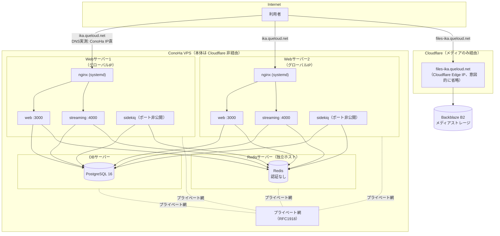

# イカトドン インフラ構成ドキュメント

このドキュメントは、イカトドン（`koba-lab/mastodon`、Mastodon のフォーク）のインフラと運用の
全体像を記録するものです。issue #876「Web サーバーへのデプロイを自動化したい」への対応を
きっかけに、インフラの全体像がドキュメントとして存在しないこと自体が根本の問題だと判明した
ため、まずこのドキュメントを整備します。

トピックごとに「今こうなっている → こうしたい」を並べる構成にしています。各節では
**「決定済み」の内容**と**「要件のみで解決策は実施時に検討する」内容**を明確に書き分けて
います。この区別が無いと、未定の項目を決定済みと誤読して実装してしまう事故が実際に起きた
ため、特に注意して区別してください。

事実には根拠を **実測 / 聞き取り / 未確認** の区分で併記します。未確認のものには ⚠️ を付けて
います。

**細かい実装仕様は、このファイルではなく `infrastructure/` 配下の個別ファイルに分離して
います。** それらは実装時にあらためて検討・検証する draft であり、内容に誤りを含みます。
AI レビューの対象外としています。詳しくは各ファイル冒頭の警告を参照してください。

- [`infrastructure/deploy-design.md`](infrastructure/deploy-design.md) — デプロイ自動化の詳細仕様（draft）
- [`infrastructure/backup-design.md`](infrastructure/backup-design.md) — PITR・鍵管理の詳細仕様（draft）

---

## 1. 全体図


```mermaid
flowchart TB
    subgraph Internet
        User[利用者]
    end

    subgraph CF["Cloudflare（メディアのみ経由）"]
        CFProxy["files-ika.queloud.net<br/>（Cloudflare Edge IP、意図的に省略）"]
    end

    B2[(Backblaze B2<br/>メディアストレージ)]

    subgraph ConoHa["ConoHa VPS（本体は Cloudflare 非経由）"]
        subgraph Host1["Webサーバー1<br/>（グローバルIP）"]
            Nginx1["nginx (systemd)"]
            Web1["web :3000"]
            Stream1["streaming :4000"]
            Sidekiq1["sidekiq（ポート非公開）"]
            Nginx1 --> Web1
            Nginx1 --> Stream1
        end

        subgraph Host2["Webサーバー2<br/>（グローバルIP）"]
            Nginx2["nginx (systemd)"]
            Web2["web :3000"]
            Stream2["streaming :4000"]
            Sidekiq2["sidekiq（ポート非公開）"]
            Nginx2 --> Web2
            Nginx2 --> Stream2
        end

        subgraph DBHost["DBサーバー"]
            PG[(PostgreSQL 16)]
        end

        subgraph RedisHost["Redisサーバー（独立ホスト）"]
            Redis[(Redis<br/>認証なし)]
        end

        Priv["プライベート網（RFC1918）"]
    end

    User -->|"ika.queloud.net<br/>DNS実測: ConoHa IP直"| Nginx1
    User -->|"ika.queloud.net"| Nginx2
    User -->|"files-ika.queloud.net"| CFProxy --> B2

    Host1 -. "プライベート網" .- Priv
    Host2 -. "プライベート網" .- Priv
    DBHost -. "プライベート網" .- Priv
    RedisHost -. "プライベート網" .- Priv

    Web1 --> PG
    Web1 --> Redis
    Web2 --> PG
    Web2 --> Redis
    Sidekiq1 --> PG
    Sidekiq1 --> Redis
    Sidekiq2 --> PG
    Sidekiq2 --> Redis
    Stream1 --> PG
    Stream1 --> Redis
    Stream2 --> PG
    Stream2 --> Redis
```

- 本体（`ika.queloud.net`）は Cloudflare を経由せず、ConoHa の IP がそのまま DNS に返る（実測）。
- メディア（`files-ika.queloud.net`）のみ Cloudflare 経由で Backblaze B2 に向いている（実測・
  聞き取り）。メディアは移管済みでこのドキュメントの対象外。
- 構成は **Web 2台・DB 1台・Redis 1台の計4台**。Redis は DB とは別の独立したホストで動いて
  いる（issue #876 の記載 + 実測。以前の版で Redis を DB サーバー内に描いていたのは誤り）。
- Web / DB / Redis はプライベート網（RFC1918）で相互通信する（実測: nginx の `allow` 設定、
  DB の `pg_hba.conf`）。
- `streaming` も PostgreSQL / Redis に直接接続する（実測: `streaming/database.js:18,26`、
  `streaming/redis.js:100` が接続設定を読み込んでいる）。図の依存線は `web` / `sidekiq` に
  加えて `streaming` からも PG / Redis へ引いている。

⚠️ **本ドキュメントでは、実際のグローバル IP アドレス・具体的なプライベートネットワークの
レンジは意図的に記載していません**（このリポジトリはパブリックであるため）。実際の値は
運用者のみが把握しています。「Redis に認証が無い」「`ufw` が無効」といった運用上の既知の
問題そのものはドキュメントの目的（宿題の記録）に必要な情報のため、そのまま残しています。

---

## 2. サーバー構成 / ネットワーク

### 2.1 確定した事実

| 項目                                 | 事実                                                                                                                                                                                             | 根拠                               |
| ------------------------------------ | ------------------------------------------------------------------------------------------------------------------------------------------------------------------------------------------------ | ---------------------------------- |
| Web サーバー                         | **2台**（グローバル IP は意図的に省略。パブリックリポジトリのため）                                                                                                                              | DNS 実測                           |
| Cloudflare                           | 本体には噛んでいない（メディアのみ）                                                                                                                                                             | ConoHa の IP がそのまま DNS に返る |
| プライベート網                       | Web / DB / Redis が同じプライベート網（RFC1918）に載っている（具体的なレンジは意図的に省略）                                                                                                     | 設定ファイル実測                   |
| メディア                             | Backblaze B2（`S3_ENABLED=true`、`S3_ALIAS_HOST=files-ika.queloud.net`）                                                                                                                         | `.env.production` 実測             |
| `public/system` のディスク上のデータ | オブジェクトストレージ移行前の**レガシー残骸**。参照されていない                                                                                                                                 | 聞き取り + `S3_ENABLED=true`       |
| 静的ファイル配信                     | **アプリ（イメージ内）が配信できる**。Dockerfile が `RAILS_SERVE_STATIC_FILES="true"` を設定（`Dockerfile:38,54`、`config/application.rb:89`）。`.env.production` に無くてもイメージ側の値が効く | 実測                               |
| **Elasticsearch**                    | **使っていない**（`.env.production` に設定なし）                                                                                                                                                 | 実測                               |
| **New Relic**                        | **OTEL でアプリのトレース・メトリクスを送信中**（`OTEL_EXPORTER_OTLP_ENDPOINT`）                                                                                                                 | 実測                               |
| **`ufw`**                            | **非アクティブ（無効）**                                                                                                                                                                         | 実測                               |
| **Redis の認証**                     | **無し**（`REDIS_PASSWORD` は空）。⚠️ **到達範囲（プライベート網からのみか、外部からも届くか）は未確認**（9.2節 #15、10節参照）                                                                  | 聞き取り（認証無しの部分のみ）     |
| `docker-compose.override.yml`        | 本家の `.gitignore` で除外（73行目）                                                                                                                                                             | 実測                               |
| `.env.production`                    | 同じく除外（28行目）。各ホストに手置きで、**バックアップ無し**                                                                                                                                   | 実測                               |
| バックアップ cron                    | **未確認**。playbook に定義があるだけで、その playbook は壊れている                                                                                                                              | —                                  |

### 2.2 `CLAUDE.md` との整合

`CLAUDE.md` にはこのドキュメントの検討中にリポジトリへ追加された運用ルールがあり、以下は
それとの整合を取った内容です。

- **ブランチ運用**: `ikatodon` がデフォルトブランチ（本番相当）、`master` は上流追随用。機能
  PR は `master` へ向ける。`master → ikatodon` の昇格 PR は `ikatodon-promote-pr.yml` が
  自動作成する
- **migration は `docker compose run --rm web` で実行する。`exec` は使わない**（稼働中の旧
  コンテナの中で実行され、新しいマイグレーションファイルが存在しないまま「何もせず成功」
  するため）。`up -d` の前後で `down` は不要
- **CI 必須チェックの制約**: `lint` という名前は `format-check` と `lint-*` の5本が同じジョブ
  名になっており区別できない。`paths` フィルタ付きのワークフロー（`lint-ruby` 等）は変更
  パスによっては実行されないため必須にしない。常に実行されるのは `test-ruby.yml` と
  `format-check.yml` の2本
- 上流追随手順にある「`docker-compose.yml` のイメージタグを3箇所更新する」という手順は、
  compose のテンプレート化（[`infrastructure/deploy-design.md`](infrastructure/deploy-design.md)
  参照）が実現すると不要になる。**`CLAUDE.md` 側の更新も別途必要**（本 PR の対象外、別 PR
  で対応する）

### 2.3 実測で否定された推測

以前の検討で立てた推測のうち、実測・聞き取りで誤りと判明したものを記録します。同じ誤りを
繰り返さないための記録です。

| 前言                                               | 実際                                                                   |
| -------------------------------------------------- | ---------------------------------------------------------------------- |
| Origin CA で Let's Encrypt を撤去できる            | Cloudflare が本体経路に居ないため不可                                  |
| `real_ip` 未設定で `geo $allow_ip` が壊れている    | 杞憂。`$remote_addr` は実クライアント IP                               |
| Cloudflare が1台停止時に他へ自動で振り替えてくれる | 経路に居ないため振り替えない。有料 Load Balancing は費用面で不採用済み |
| サーバー間通信に HTTPS が必要                      | 不要。プライベート網があるので平文 HTTP でよい                         |
| Web サーバーは4台                                  | 2台                                                                    |
| `public/` を消すと古い画像が壊れる                 | 誤り。移行前から既に別のオブジェクトストレージで配信していた           |
| 監視は Mackerel（DB のみ）だけ                     | 誤り。New Relic が既に稼働中（7節）                                    |

### 2.4 決定事項 — 構成方針

| 項目                                                             | 決定                      | 理由                                     |
| ---------------------------------------------------------------- | ------------------------- | ---------------------------------------- |
| 基本構成（ConoHa VPS / Docker Compose / 自前 PostgreSQL・Redis） | **維持**                  | 困りごとは構成ではなく記録の不在と属人化 |
| メディア                                                         | **対象外**（B2 移管済み） | いつでも移設できる体制がある             |
| DB / Redis のマネージド化                                        | **不採用**                | 料金。プライベート網の利点も失う         |
| Cloudflare 有料 Load Balancing                                   | **不採用**                | 有料。検討のうえ却下済み                 |

Web サーバー本体を Cloudflare 経由にするかどうか（トラック C）は実施未定。判断材料の聞き取り
すら済んでいないため、詳細な検討はまだ行っていない（10節「聞き取りが必要なもの」参照）。

---

## 3. アプリケーション（コンテナ、バージョン管理、ログ）

### 3.1 今の構成（実測）

- コンテナは `web` / `streaming` / `sidekiq` の3種類。
- `web` と `streaming` は `127.0.0.1` にのみバインドしている。**`sidekiq` はポートを公開して
  いない**ため、「3種類すべてが `127.0.0.1` にバインドしている」という言い方は不正確（この
  制約が当てはまるのは `web` と `streaming` のみ）。
- `docker-compose.override.yml` は本家の `.gitignore` で除外されている（73行目）。
- `.env.production` も同じく除外されている（28行目）。**各ホストに手置きで、バックアップが
  無い**（聞き取り + `.gitignore` 確認。詳細は6節）。

compose ファイルのテンプレート化・構成管理（Ansible）の検討中の詳細は
[`infrastructure/deploy-design.md`](infrastructure/deploy-design.md) を参照してください。

---

## 4. nginx

### 4.1 今の構成（実測）

- nginx はホストの systemd で動く。**Docker の外**。`user mastodon` で稼働。
- `acme-challenge` upstream に、現役でない IP が2つ残っている（既知の問題 #7）。

ゼロダウンタイムデプロイ（隣サーバーへのフォールバック、drain）の検討中の詳細は
[`infrastructure/deploy-design.md`](infrastructure/deploy-design.md) を参照してください。

### 4.2 未確認事項

**確認済み**（既知の問題 #12。9.1節参照）: 実際に `500.html` に到達できないことを確認した
（オーナーによる実機確認）。`error_page` の第2引数が URI として解釈され `root` と二重連結
されるためと見られる。

⚠️ `nginx.conf` に `ssl_protocols TLSv1 TLSv1.1` が残っている疑いがある（既知の問題
#14）。`sudo nginx -T` で確認する。

### 4.3 決定事項 — API 経由の新規登録を nginx で遮断する（2026-11-01）

**決定**: `POST /api/v1/accounts`（アプリ・API からのアカウント作成）を nginx で 403 にする。
Web の登録フォーム（`/auth/sign_up` → `POST /auth`）は従来どおり使える。上流コードには
手を入れない（`CLAUDE.md` の最重要方針）ため、アプリ側ではなくホストの nginx で止める。

**経緯**: 2026年9月ごろから、Mastodon インスタンス全般に自動の偽登録が来ている。イカトドンでも
10月下旬から急増し、30日間の新規ユーザーが 559 件（前期比 +710%）になった。特徴は以下で、
他インスタンスの報告と一致する。

- ユーザー名が `bp` + 16桁の16進（例: `bp4be6f4d2bd7a9240`）
- メールアドレスは icloud / au / ezweb / gmail などの実在の個人アドレスで、オーナーが確認
  したところ無関係な第三者のものだった。誰も認証しない
- 登録ごとに IP が異なる（住宅用プロキシ経由と報告されている）ため、IP 単位のレート制限が
  効かない
- サインアップソースが「Mastodon Web App」「Fediverse」「Web」など名前を変えた OAuth アプリ
  で、ほぼ全件が API 経由
- 目的は不明。実害は、知らない人に確認メールが送られ、SES の苦情率と送信元ドメインの評価が
  下がること

未認証アカウント自体は `Scheduler::UserCleanupScheduler` が確認メール送信から7日後に削除
する（`UNCONFIRMED_ACCOUNTS_MAX_AGE_DAYS = 7`）ため、手動で消す必要はない。問題はメールが
送られることの方で、それを止めるには登録そのものを入口で止めるしかない。

**検討して採らなかった案**

| 案                                           | 不採用の理由                                                             |
| -------------------------------------------- | ------------------------------------------------------------------------ |
| 承認制にする                                 | v4.6 では承認前に確認メールが送られるため、メール送信が止まらない        |
| hCaptcha                                     | 確認リンクを踏んだ後に出るため、登録とメール送信を防げない               |
| メールドメインブロック                       | 日本のキャリアドメインを塞ぐことになり、イカトドンの利用者層では使えない |
| ユーザー名の DB 制約・アプリ名ブロックリスト | 独自パッチになる。攻撃側がパターンを変えれば効かなくなる                 |
| 新規登録の一時停止                           | 正規の登録者まで止まる。API 遮断なら Web からの登録は残せる              |

**設定**（Web サーバー2台の両方、`ika.queloud.net` の `server { listen 443 ... }` 内に置く。
nginx の設定ファイルはホストにあり、このリポジトリでは管理していない）

```nginx
# API 経由の新規登録を遮断する（ikatodon/docs/infrastructure.md 4.3節）
# GET /api/v1/accounts（アカウントの一括取得）は通す
# Rails は末尾スラッシュを無視するため、/api/v1/accounts/ も同じく塞ぐ
location ~ ^/api/v1/accounts/?$ {
  default_type application/json;

  if ($request_method = POST) {
    return 403 '{"error":"このサーバーではアプリからの新規登録を受け付けていません。https://ika.queloud.net/auth/sign_up から登録してください。"}';
  }

  try_files $uri @proxy;
}
```

- `$` で終端を固定しているので、`/api/v1/accounts/:id/follow` などの下位パスには影響しない
- 末尾スラッシュ付き（`/api/v1/accounts/`）も Rails では同じ登録処理に届くため、`/?` で両方を
  受けている。API のルートは `format: false`（`config/routes/api.rb`）なので `.json` 付きの
  別名は無い。スラッシュの重複やパーセントエンコードは nginx が location 照合の前に正規化する
- 正規表現の location は書いた順に評価され、最初に一致したものが使われる。2026-11 時点の設定で
  他の正規表現 location は `^/(emoji|packs|system/accounts/avatars|system/media_attachments/files)`
  だけで、`/api/v1/accounts` とは重ならないため、置く位置は問わない。今後 `/api` に一致する
  正規表現 location を足す場合は、これより後ろに置くこと
- `try_files` の名前付き location（`@proxy`）は、既存の `location /` と同じものに合わせる
- Mastodon のアプリは API エラーの `error` をそのまま表示するため、JSON で理由を返している
- `if` の中は `return` だけなので、nginx の「if is evil」には当たらない

**反映と確認**

```bash
sudo nginx -t && sudo systemctl reload nginx

# 両方とも 403 と JSON が返ること
curl -s -w '\n%{http_code}\n' -X POST https://ika.queloud.net/api/v1/accounts
curl -s -w '\n%{http_code}\n' -X POST https://ika.queloud.net/api/v1/accounts/

# GET は通ること（403 以外が返る）
curl -s -o /dev/null -w '%{http_code}\n' 'https://ika.queloud.net/api/v1/accounts?id[]=1'
```

反映後は、管理画面ダッシュボードの「新規ユーザー」と「サインアップソース」で、アプリ名
経由の登録が止まったことを確認する。

**影響**: 公式アプリなどアプリ内からの新規登録はできなくなり、Web から登録してもらう形に
なる。既存ユーザーのログイン・アプリ利用（`/api/v1/apps` や OAuth）には影響しない。

**見直す条件**: 上流 [PR #40690](https://github.com/mastodon/mastodon/pull/40690)（承認が
済むまで確認メールの送信を保留するサーバー設定。2026-10-15 に `main` へマージ、v4.6.10 には
未収録）が、追随するバージョンに入ったら、「承認制 + 確認メール保留」への切り替えを検討し、
この `location` を外すか判断する。

参考:

- [Fake sign-ups with 'Automated protocol deliverability probe': Countermeasures](https://javahippie.net/mastodon/security/2026/09/11/mastodon-signup-spam.html)
- [mastodon-lab incident 010: automated registration abuse](https://github.com/thanksstevenkim/mastodon-lab/blob/main/incidents/010-automated-registration-abuse-boomprotocolprobe.md)

### 4.4 確認済み — 起動時に nginx が落ちて Web サーバー1台が4日間止まっていた（2026-10-27〜11-01）

**起きたこと**: 2026-10-27 の ConoHa のメンテナンスで Web サーバーが再起動された際、片方の
Web サーバーだけ nginx が起動せず、11-01 に気づいて手動で起動するまでの約4日間、そのサーバーは
リクエストを受けられなかった。もう1台は動いていたため、サイト全体は落ちていない。ただ、DNS で
停止中のサーバーに振られた利用者は、接続できないか、もう1台へのフォールバックで遅くなって
いたはず。

**原因**（実測: `/var/log/nginx/error.log` と `/var/log/syslog`）: もう使っていない
`test.ika.queloud.net` のサイト設定が `sites-enabled` に残っており、その中で Wasabi の
ホスト名 `s3.us-west-1.wasabisys.com` を upstream に書いていた。nginx はホスト名を
`nginx -t` の時点で名前解決するため、起動直後でまだ DNS が使えないと
`host not found in upstream` で `ExecStartPre` の `nginx -t` が失敗し、無関係な
`ika.queloud.net` を含めて nginx 全体が起動しなかった。

```
nginx: [emerg] host not found in upstream "s3.us-west-1.wasabisys.com" in /etc/nginx/sites-enabled/test.ika.queloud.net:138
nginx: configuration file /etc/nginx/nginx.conf test failed
systemd[1]: nginx.service: Failed with result 'exit-code'.
```

- `nginx.service` は `enabled` で、自動起動の設定に漏れは無かった
- もう1台も同じ `test.ika.queloud.net` を有効にしていた。起動時に nginx より先に DNS が
  使えるようになっていたため、たまたま助かっただけで、次の再起動では逆になり得た
- `systemctl status` は `failed` のまま4日間誰も気づかなかった。nginx プロセスの死活監視が
  無いことは 7節の監視の課題と同じ根を持つ

**対処**（2026-11-01、2台とも）: `sites-enabled/test.ika.queloud.net` のシンボリックリンクを
削除した（`sites-available` の実ファイルは残している）。あわせて
`conflicting server name "default_server"` の warning も消えた。

対処後に `sudo nginx -T | grep -nE 'proxy_pass|^\s*server\s'` で、upstream と `proxy_pass` が
`127.0.0.1` と IP 直書きだけになり、起動時の名前解決に依存する箇所が無いことを確認した。

**今後の注意**: nginx の設定に `proxy_pass` や `upstream` でホスト名を書くと、起動時の DNS の
状態次第で nginx 全体が起動しなくなる。ホスト名が必要な場合は `resolver` と変数を使った
`proxy_pass` で実行時解決にするか、IP で書くこと。使わなくなったサイト設定は
`sites-enabled` から外しておくこと。

---

## 5. デプロイ

### 5.1 現状の手順（聞き取り）

手動デプロイ。Web サーバー上で `git pull`（本体の checkout）を行っている。「本家で必要と
される追加コマンド」がどこにも記録されていない（既知の問題 #4）。post deployment
migration を「1台目だけ新しい」状態で実行してしまっている（既知の問題 #3）。

GitHub Actions によるデプロイ自動化（`releases/` + `current` 方式、ロールバック、検証の
分担など）の検討中の詳細は [`infrastructure/deploy-design.md`](infrastructure/deploy-design.md)
を参照してください。ssh 経路が実際に通るかどうかは未確認です（10節参照）。セルフホスト
ランナーは採用しない方針です（このフォークはパブリックリポジトリで、フォークからの PR で
任意コードがサーバー上で実行され得るため）。

---

## 6. バックアップと復旧

### 6.1 現状（実測・聞き取り）

- バックアップ cron は **未確認**。`ikatodon-db` の playbook に定義があるだけで、その
  playbook（`deploy-postgres.yml`）は存在しない `docker-compose.postgres16.yml` を参照して
  おり**実行できない**（既知の問題 #1）。
- `restore.sh` が対話式で、緊急時に自動実行できない（既知の問題 #5）。
- `.env.production` にバックアップが無い（既知の問題 #11）。

PITR（WAL アーカイブ + ベースバックアップ）の方向性と、鍵ごとの喪失影響・保管方針の検討中の
詳細は [`infrastructure/backup-design.md`](infrastructure/backup-design.md) を参照してください。

---

## 7. 監視

### 7.1 現状（実測・聞き取り）

- **New Relic が既にアプリのトレース・メトリクスを OTEL 経由で受けている**（実測）。
- Mackerel は DB サーバーに導入済み。Web サーバー側の Mackerel 監視の有無は ⚠️ **未確認**
  （聞き取りが必要。10節参照）。

### 7.2 決定事項 — New Relic と Mackerel の併用

役割を分けて併用する。

|               | 担当                                                       |
| ------------- | ---------------------------------------------------------- |
| **New Relic** | アプリのトレース、性能（レスポンスタイム、キュー滞留など） |
| **Mackerel**  | サーバーのメトリクス、外形監視                             |

**アラートの通知先は一本化する。**

外形監視に加えて次の4項目を監視する:

| 対象                         | 理由                                                            |
| ---------------------------- | --------------------------------------------------------------- |
| **ディスク残量**             | PITR で `pg_wal` が溜まって DB 停止する事故が現実的になる。必須 |
| **証明書の期限**             | 自動更新が壊れても切れるまで気づけない                          |
| **デプロイの失敗**           | GitHub Actions の通知で足りる。追加コストなし                   |
| **CPU / ネットワークの異常** | マイニング検知を兼ねる                                          |

**入れないもの**: レスポンスタイム、キュー滞留。これらは New Relic 側で見られるため重複して
監視しない。**障害対応の手順書は作らない。** まずは「止まったことに気づける」状態を作ること
を優先する。

Mackerel を **Web 2台にも入れる**（DB には導入済み。⚠️ Web 側の現状は7.1節の通り未確認だが、
導入する方針自体は変わらないため、導入前に重複導入がないか確認する）。⚠️ 無料枠のホスト数は
未確認（10節参照）。

### 7.3 見つけた穴

`ikatodon-db/docker-compose.yml` の mackerel-agent が `/var/run/docker.sock:ro` を
マウントしている。**`:ro` はほぼ無意味**で、このソケットに触れれば任意のコンテナを特権起動
できる。**agent が乗っ取られれば実質ホストの root** を取られる。Web 2台にも Mackerel を
入れるなら同じ構成が増えることになるため、判断が要る（既知の問題 #10）。

---

## 8. セキュリティ

**このセクションは要件のみを定めるものであり、具体的な解決策（ツール・実装）は未定です。
実施のタイミングで改めて選定します。** 理想像には含めますが、以下を「決定済み」と誤読しない
でください。

### 8.1 要件

- 侵害されていないかを確認できる（永続化・バックドアの設置に気づける）
- マイニングに使われていないかを確認できる
- 予防側を固める（パッチ適用、鍵の権限、SSH は鍵のみ、Docker ソケットの扱い）

具体的な候補（ツールの比較検討）はまだ行っていません。9節「既知の問題」に記録済みの穴
（`ufw` 無効、Redis の認証無し、Docker ソケットのマウント）が対応対象です。

---

## 9. 既知の問題

### 9.1 確認済み

| #   | 問題                                                                                                                                                                                                       |
| --- | ---------------------------------------------------------------------------------------------------------------------------------------------------------------------------------------------------------- |
| 1   | `ikatodon-db/deploy-postgres.yml` が存在しない `docker-compose.postgres16.yml` を参照している。実行できない                                                                                                |
| 2   | 同 compose の `PRIVATE_IP` デフォルトが `0.0.0.0`。設定を抜くと PostgreSQL が全世界に開く                                                                                                                  |
| 3   | post deployment migration を「1台目だけ新しい」状態で実行している                                                                                                                                          |
| 4   | 「本家で必要とされる追加コマンド」がどこにも記録されていない                                                                                                                                               |
| 5   | `restore.sh` が対話式で緊急時に自動実行できない                                                                                                                                                            |
| 6   | Ansible の `docker_compose` モジュールは非推奨                                                                                                                                                             |
| 7   | `acme-challenge` upstream に現役でない IP が2つ残っている                                                                                                                                                  |
| 8   | イメージタグを本家の `docker-compose.yml` に直接書いており毎リリース衝突する                                                                                                                               |
| 9   | Docker の `json-file` ログに上限指定が無い                                                                                                                                                                 |
| 10  | `ufw` が無効 / Redis に認証が無い / Docker ソケットのマウント（7.3節）                                                                                                                                     |
| 11  | `.env.production` にバックアップが無い                                                                                                                                                                     |
| 12  | `error_page` が `/home/mastodon/live/public/500.html` を URI として `root` と二重連結しており、実際に到達できないことを確認済み（オーナーによる実機確認。4.2節）                                           |
| 17  | 使っていない `test.ika.queloud.net` の設定にあった Wasabi のホスト名が原因で、再起動時に nginx が起動せず、Web サーバー1台が約4日間止まっていた。2026-11-01 に `sites-enabled` から外して対処済み（4.4節） |

### 9.2 要確認

| #   | 疑い                                                                                                                                                    | 確認方法                                                                                            |
| --- | ------------------------------------------------------------------------------------------------------------------------------------------------------- | --------------------------------------------------------------------------------------------------- |
| 13  | 全台で同じ `bundle exec sidekiq` が動いていると `scheduler` が多重実行される可能性                                                                      | 稼働中コンテナの command を直接確認（10節）                                                         |
| 14  | `nginx.conf` に `ssl_protocols TLSv1 TLSv1.1` が残る                                                                                                    | `sudo nginx -T`                                                                                     |
| 15  | Redis ホストの `docker-compose.yml` が `ports: 6379:6379` でコンテナを直接公開している疑い（nginx 経由ではない）。Docker の publish は ufw を迂回し得る | Redis ホストで `docker compose config` の `ports` 設定を確認、`sudo ufw status`、外部からの疎通確認 |
| 16  | GitHub-hosted runner から Web サーバーへ実際に SSH（22/tcp・鍵認証）が通るか。`ufw` が無効なことは到達性を保証しない                                    | 実際に workflow から接続して確認する（デプロイ自動化の実装時）                                      |

---

## 10. 未確認事項と確認コマンド

以下のコマンドの結果を貼れば、後続の作業（Ansible テンプレート化、デプロイ自動化の実装
など）に進めます。**貼る前に、秘密値・ホスト名・不要な内部情報が含まれていないか確認して
ください。** 特に `sudo nginx -T`（全 include をまとめて出力するため証明書パスや内部情報が
混ざり得る）、`sudo crontab -l -u mastodon`（ジョブの引数や環境変数が混ざり得る）、
`docker compose config`（後述のとおり `.env.production` の秘密値が混ざる）の3つは注意が
必要です。

⚠️ **`ip -4 addr` の結果はここ（公開 PR）には貼らない。** 出力にはプライベート IP とグロー
バル IP の両方が含まれ、本ドキュメントの「実 IP は意図的に記載しない」方針と矛盾する。この
項目だけは秘密管理下で確認し、結果を直接 Ansible の変数（`PRIVATE_IP` 等）へ記録すること。

```bash
sudo nginx -T                                     # Ansible テンプレート化の元データ
sudo ufw status                                   # Redis の 6379/tcp 等が ufw で防御されているか（#15）
# Redis ホストの 6379/tcp が外部（インターネット）から疎通できないか確認する（#15）
sudo crontab -l -u mastodon                       # バックアップ cron が本当にあるか（-u は root 権限が必要）
ls -la /opt/mastodon/backups/
docker exec mastodon_postgres16 du -sh /var/lib/postgresql/data/pg_wal   # PGDATA はホストから直接走査できないためコンテナ内で確認
docker exec mastodon_postgres16 psql -U mastodon -d mastodon_production \
  -c "SELECT * FROM pg_stat_archiver;"
time /opt/mastodon/backup.sh                      # 10分前後の見込み
docker inspect --format '{{.Config.Cmd}}' <sidekiq コンテナ名>   # scheduler 重複（#13）
# GHA runner からの ssh 到達性（#16）。GitHub-hosted runner の IP レンジから
# 22/tcp への到達性と鍵認証が通るかは、実際に workflow から接続して確認する必要がある
docker inspect --format '{{index .Config.Labels "com.docker.compose.project"}}' <稼働中コンテナ名>
                                                   # 現行の COMPOSE_PROJECT_NAME（releases/ 移行時に要一致）
```

⚠️ **`ip -4 addr` は上記の理由により公開 PR には貼らない**（秘密管理下で直接 Ansible 変数へ）。

> ⚠️ **`docker compose config` はここでは使わない。** `env_file` の内容を解決して出力するため、
> 結果を貼ると `.env.production` の秘密値が混ざって公開先に漏洩し得る（Copilot 指摘）。
> sidekiq の `scheduler` 重複確認には、稼働中コンテナの command だけを直接見る
> `docker inspect` を使う。
>
> Elasticsearch の使用有無は 2.1節の実測で「使っていない」と確定済みのため、ここでの
> 再確認コマンドは不要（以前の版にあった `grep ES_ENABLED` 系のコマンドは削除した）。

### 聞き取りが必要なもの

| 項目                                               | なぜ必要か                                     |
| -------------------------------------------------- | ---------------------------------------------- |
| Web サーバー側の Mackerel 監視の有無               | 7節の前提                                      |
| **Web サーバーを Cloudflare 経由にしていない理由** | 記録が無い。トラック C の判断材料              |
| Mackerel 無料枠で許容されるホスト数                | DB 1台 + Web 2台の計3台を追加できるか（7.2節） |

---

## 付録: ロードマップ

| 段階 | 内容                                                         | 依存 |
| ---- | ------------------------------------------------------------ | ---- |
| 0    | 10節の未確認事項を埋める                                     | —    |
| 1    | 危険な既知問題の修正（#1 #2 #9 #10 #11）                     | 0    |
| 2    | Ansible で nginx / ufw / compose override を構成管理下に置く | 0    |
| 3    | デプロイ自動化（issue #876 本体）                            | 2    |
| 4    | PITR（3 と並行可）                                           | 0    |
| 5    | 監視の拡張（7節）                                            | 0    |

セキュリティの解決策選定（8節）、Cloudflare 化の判断（トラック C）は、判断材料が揃って
いないため段階に組み込んでいません。実施するタイミングであらためて検討します。
