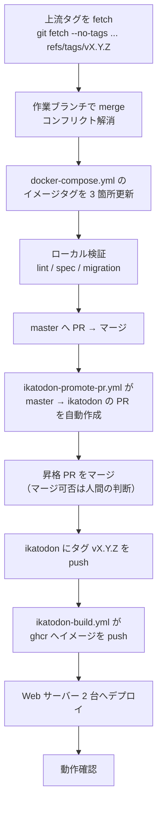

# イカトドン リリース手順

上流 [mastodon/mastodon](https://github.com/mastodon/mastodon) の新バージョンを取り込んでから、
本番の Web サーバー 2 台に反映するまでの手順です。デプロイ自動化（GitHub Actions からの
`releases/` + `current` 方式）は検討中で、**現時点では手動リリース**です。自動化後の設計は
[`infrastructure/deploy-design.md`](infrastructure/deploy-design.md) を参照してください。

関連ドキュメント:

- `CLAUDE.md` — 上流追随の判断基準（独自差分を増やさない方針、コンフリクト解消の考え方）
- [`infrastructure.md`](infrastructure.md) — サーバー構成、既知の問題

---

## 0. 全体像



リリース作業は大きく 3 つに分かれます。

| フェーズ                   | 場所              | 節   |
| -------------------------- | ----------------- | ---- |
| 上流追随（コード取り込み） | 手元 + GitHub     | 1〜3 |
| イメージビルド             | GitHub Actions    | 4    |
| デプロイ                   | Web サーバー 2 台 | 5〜6 |

---

## 1. 上流の取り込み

手順の詳細と判断基準は `CLAUDE.md`「上流バージョン追随の手順」にあります。ここでは
リリース作業として実行する形にまとめ直しています。

```bash
# 1-1. 上流タグを fetch する（リモートを追加せず、タグだけ取る）
git fetch --no-tags https://github.com/mastodon/mastodon \
  refs/tags/vX.Y.Z:refs/tags/vX.Y.Z

# 1-2. 作業前の独自差分を記録する（作業後の比較に使う）
git diff --name-only <現行タグ> HEAD > /tmp/before-files.txt
git diff --shortstat  <現行タグ> HEAD

# 1-3. コンフリクトしうる範囲を事前に把握する
comm -12 <(git diff --name-only <現行タグ> HEAD | sort) \
         <(git diff --name-only <現行タグ> vX.Y.Z | sort)

# 1-4. master から作業ブランチを切ってマージする
git fetch origin master
git checkout -B upgrade/vX.Y.Z origin/master
git merge vX.Y.Z
```

コンフリクトの解消基準は「そのファイルにイカトドン独自の変更が入っているか」です。

- **独自変更なし** → 上流版をそのまま採用する（失われるものはない）
- **独自変更あり** → 独自部分を保持しつつ上流の変更を取り込む

### 1-5. `docker-compose.yml` のイメージタグを更新する

`web` / `streaming` / `sidekiq` の 3 箇所です。上流版は `ghcr.io/mastodon/mastodon` を指すため
**毎リリース必ずコンフリクトします**（既知の問題 #8）。イカトドン側のイメージ名を残したまま、
タグだけ新バージョンへ上げます。

```yaml
image: ghcr.io/koba-lab/ikatodon:vX.Y.Z            # web
image: ghcr.io/koba-lab/ikatodon-streaming:vX.Y.Z  # streaming
image: ghcr.io/koba-lab/ikatodon:vX.Y.Z            # sidekiq
```

```bash
grep -n "ghcr.io/koba-lab" docker-compose.yml   # 3 行出ることを確認する
```

### 1-6. 独自差分が増えていないことを確認する

作業前（1-2）と作業後で**ファイル集合と行数が一致**していれば、独自差分の増減はゼロです。
一致しない場合は、意図せず上流コードに手を入れたか、上流の変更を取りこぼしています。

```bash
diff <(sort /tmp/before-files.txt) <(git diff --name-only vX.Y.Z HEAD | sort)
git diff --shortstat vX.Y.Z HEAD
```

---

## 2. 検証

上流 CI と同じ内容をローカルでも通します。

```bash
bundle exec rubocop --parallel
bundle exec haml-lint
bundle exec rspec spec/models spec/lib spec/services
bundle exec rspec spec/requests spec/controllers
yarn typecheck && yarn lint:js && yarn lint:css && yarn format:check && yarn test:js run
```

### 2-1. マイグレーションの有無を先に判定する

`db/` に差分が無ければ新規マイグレーションは 0 本で、5 節のマイグレーション手順を丸ごと
省けます。**この判定はデプロイ手順の分岐に直結する**ので必ず最初に行ってください。

```bash
git diff --stat <現行タグ> vX.Y.Z -- db/     # 出力が空 = マイグレーション無し
git diff --stat vX.Y.Z HEAD -- db/schema.rb # 出力が空 = 独自スキーマずれ無し
```

マイグレーションがある場合は、上流 `.github/workflows/test-migrations.yml` と同じ 4 フローを
`RAILS_ENV=test` で実行します（詳細は `CLAUDE.md`「マイグレーション検証」）。空 DB ではなく
`rails tests:migrations:prepare_database` で履歴データを入れること。

---

## 3. PR とマージ

ブランチ運用は `CLAUDE.md` のとおりです。

1. 作業ブランチから **`master` へ PR** を出す。CI の必須チェックは `master` 側にあるので、
   ここで緑になることを確認する
2. `master` へマージする
3. `.github/workflows/ikatodon-promote-pr.yml` が push を検知し、
   **`master` → `ikatodon` の昇格 PR を自動作成**する（タイトルは `master → ikatodon (PR #NNN)`）。
   既に開いている PR があれば本文が更新されるだけで、重複して作られることはない
4. 昇格 PR をマージする。**マージするかどうかは常に人間の判断**

> 昇格 PR は既定の `GITHUB_TOKEN` で作られるため CI がトリガーされません（GitHub の仕様）。
> 中身は `master` で CI を通したものと同一なので通常は問題になりません。

---

## 4. タグ push とイメージビルド

`ikatodon` にタグを push すると `.github/workflows/ikatodon-build.yml` が動き、
`ghcr.io/koba-lab/ikatodon` と `ghcr.io/koba-lab/ikatodon-streaming` の 2 つをビルドします。

> [!IMPORTANT]
> **イカトドンのリリースタグは、上流の同名タグとは別のコミットを指します。**
> 手順 1-1 で `refs/tags/vX.Y.Z` に上流タグを取得しているため、`git tag vX.Y.Z ...` は
> `fatal: tag 'vX.Y.Z' already exists` で止まります。かといって `git tag -f` で上書きすると、
> 次回の追随で使う「現行タグ」が上流のコミットを指さなくなり、手順 1-2 / 1-6 の独自差分の
> 比較が（差分ゼロに見えて）機能しなくなります。
>
> **ローカルにタグを作らず、リモートの ref へ直接 push してください。**

```bash
git fetch --no-tags origin ikatodon
git push origin refs/remotes/origin/ikatodon:refs/tags/vX.Y.Z
```

`origin` からの fetch に `--no-tags` を付けているのも同じ理由です。付けないと、`ikatodon`
の履歴を指す koba-lab 側のリリースタグが追随してきて、上流タグと名前が衝突します。

実際、`origin` の `v4.6.5` は `39b1bbf8`（`ikatodon` のコミット）を指しており、上流の
`v4.6.5`（`1440d55b`）とは別物です。

- タグの向き先は**昇格 PR をマージした後の `ikatodon`** です。`master` に打たないこと
- 付くタグは `vX.Y.Z` と `vX.Y`（`type=pep440`）。`flavor: latest=auto` により、
  プレリリースでなければ `latest` も更新されます
- ビルドは十数分かかります。**完了を待ってから 5 節へ進んでください**。
  終わる前に `docker compose pull` すると manifest not found で失敗します

`ikatodon-build.yml` は本体と streaming を**独立したジョブ**でビルドします。片方だけ先に
出来上がっている状態があるので、**2 つとも**引けることを確認してください。

```bash
# ビルド完了の確認（2 つとも引けるようになったか）
for image in ikatodon ikatodon-streaming; do
  docker manifest inspect "ghcr.io/koba-lab/${image}:vX.Y.Z" > /dev/null \
    && echo "OK  ${image}" || echo "NG  ${image}"
done
```

---

## 5. デプロイ（Web サーバー 2 台）

前提: 本番は Web サーバー **2 台**で、**DB と Redis は 2 台で共有**しています。
**マイグレーションは DB に対する操作なので、台数分ではなく 1 回だけ**実行します。

`docker compose exec` は使わないこと。稼働中の**旧**コンテナの中で実行され、新しい
マイグレーションファイルが存在しないまま「何もせず成功」します。`run` は `image:` から
新しいコンテナを作るため、`pull` 済みなら新コードで動きます（`down` は不要）。
`--service-ports` は付けないこと（稼働中の `web` とポートが衝突します）。

### 5-0. DB のリストアポイントを作る（**毎回、必須**）

**バックアップ cron は未確認**で、その定義がある playbook は実行できない状態です
（[`infrastructure.md`](infrastructure.md) 既知の問題 #1・#5）。**既存のバックアップが
存在する前提で進めないこと。** マイグレーションの有無にかかわらず、デプロイ前に自分で
1 つ取ります。

```bash
# DB ホスト (ikatodon-db) で。出力先とファイル名は実環境に合わせること
pg_dump -Fc -d mastodon_production -f "/var/backups/pre-vX.Y.Z-$(date +%Y%m%d%H%M).dump"
ls -lh /var/backups/pre-vX.Y.Z-*.dump      # サイズが 0 でないこと
pg_restore --list /var/backups/pre-vX.Y.Z-*.dump | head   # 読めること
```

取った場所とファイル名を記録してから次へ進みます。7 節のとおり、post-deployment
マイグレーションを流した後はイメージタグを戻すだけでは巻き戻せず、ここで取った
リストアポイントが唯一の復旧手段になります。

### 5-1. 両台でコードとイメージを取得する

```bash
# 各 Web サーバーで
cd /home/mastodon/live
git pull                 # docker-compose.yml のイメージタグ更新を取り込む
grep -n "ghcr.io/koba-lab" docker-compose.yml   # vX.Y.Z になっていることを確認
docker compose pull
```

### 5-2. pre-deployment マイグレーション（**1 台目でのみ 1 回**）

マイグレーションが無いリリース（2-1 で判定）ではこの手順を飛ばします。

```bash
docker compose run --rm web \
  env SKIP_POST_DEPLOYMENT_MIGRATIONS=true bundle exec rails db:migrate
```

### 5-3. 両台のコンテナを入れ替える

```bash
# 1 台目 → 動作確認 → 2 台目、の順で行う
docker compose up -d
docker compose ps        # web / streaming / sidekiq が新しいイメージで上がったか
```

### 5-4. post-deployment マイグレーション（**全台の入れ替え後に 1 回**）

```bash
docker compose run --rm web bundle exec rails db:migrate
```

> **既知の問題 #3**: これを「1 台目だけ新しい」状態で実行してしまう事故が過去に起きています。
> post-deployment マイグレーションは旧コードが読めなくなる変更（カラム削除など）を含むため、
> **2 台とも新しいイメージになったことを確認してから**実行してください。
> マイグレーションが無いリリースではこの手順も不要です。

---

## 6. 動作確認

```bash
# 各 Web サーバーで
docker compose logs --tail=100 web sidekiq streaming   # 起動時エラーが出ていないか
curl -s localhost:3000/health                          # web
curl -s localhost:4000/api/v1/streaming/health         # streaming
```

- ブラウザでタイムラインが表示されること
- バージョンが上がっていること（`/api/v2/instance` の `version`、または管理画面）
- 画像・動画の添付が通ること（メディア処理まわりの変更があったリリースでは特に）
- Sidekiq のキューが詰まっていないこと（`/admin/sidekiq`）

---

## 7. ロールバック

**マイグレーションが無いリリースなら、イメージタグを戻すだけで巻き戻せます。**

```bash
# docker-compose.yml の 3 箇所を 1 つ前のタグへ戻して
docker compose pull
docker compose up -d
```

マイグレーション（特に post-deployment）を実行済みの場合、**DB スキーマはイメージを戻しても
戻りません**。旧コードが新スキーマで動かないときは DB のリストアが必要になります
（[`infrastructure/backup-design.md`](infrastructure/backup-design.md)）。
5-0 で取ったリストアポイントが唯一の復旧手段です。

---

## 8. チェックリスト

コピーして使ってください。

```
## 上流追随
- [ ] 上流タグを fetch した
- [ ] 作業前の独自差分（ファイル集合・行数）を記録した
- [ ] マージし、コンフリクトを解消した
- [ ] docker-compose.yml のイメージタグを 3 箇所更新した
- [ ] 作業後の独自差分が作業前と一致することを確認した
- [ ] db/ の差分を確認し、マイグレーションの有無を判定した（有 / 無）
- [ ] db/schema.rb が上流と一致することを確認した

## 検証
- [ ] rubocop / haml-lint
- [ ] rspec（models, lib, services / requests, controllers）
- [ ] typecheck / lint:js / lint:css / format:check / test:js
- [ ] （マイグレーションがある場合）test-migrations 相当の 4 フロー

## マージとビルド
- [ ] master へ PR を出し、CI が緑になった
- [ ] master へマージした
- [ ] 自動作成された master → ikatodon の昇格 PR をマージした
- [ ] ikatodon にタグ vX.Y.Z を push した（ローカルにタグを作らず ref へ直接 push）
- [ ] ghcr のイメージビルドが完了した（ikatodon / ikatodon-streaming の 2 つとも引ける）

## デプロイ
- [ ] DB のリストアポイントを取り、サイズと pg_restore --list を確認した
- [ ] 1 台目: git pull / docker compose pull
- [ ] 2 台目: git pull / docker compose pull
- [ ] （マイグレーション有）pre-deployment マイグレーションを 1 回実行した
- [ ] 1 台目: docker compose up -d → 動作確認
- [ ] 2 台目: docker compose up -d → 動作確認
- [ ] （マイグレーション有）全台入れ替え後に post-deployment マイグレーションを 1 回実行した
- [ ] バージョン表示・タイムライン・メディア添付・Sidekiq を確認した
```

---

## 付録: v4.6.8 リリース（2026-09-15）の実例

上流の緊急セキュリティリリースを取り込んだ回です。v4.6.5 からの追随で、
v4.6.6 / v4.6.7 / v4.6.8 の 3 バージョン分がまとめて入っています。

### セキュリティ修正の内容

| バージョン | 内容                                                                                                                                                                      |
| ---------- | ------------------------------------------------------------------------------------------------------------------------------------------------------------------------- |
| v4.6.7     | LDAP / PAM / SSO アカウントの 2FA でパスワード認証がバイパスできる（[GHSA-vx32-x96w-qq65](https://github.com/mastodon/mastodon/security/advisories/GHSA-vx32-x96w-qq65)） |
| v4.6.7     | 病的な JSON-LD アクティビティの処理による DoS（[GHSA-vgm8-frgh-rh2v](https://github.com/mastodon/mastodon/security/advisories/GHSA-vgm8-frgh-rh2v)）                      |
| v4.6.7     | 無効化されたスタッフアカウントが管理 API にアクセスできる（[GHSA-62j4-hvj7-px3f](https://github.com/mastodon/mastodon/security/advisories/GHSA-62j4-hvj7-px3f)）          |
| v4.6.7     | 依存ライブラリの更新（`mail` / `activestorage`）                                                                                                                          |
| v4.6.8     | HEIF サポートの一時的な無効化                                                                                                                                             |

### 作業結果

- **コンフリクト**: `docker-compose.yml` のみ（イメージタグ 3 箇所）。
  事前の積集合では `app/javascript/mastodon/locales/ja.json` と
  `app/javascript/styles/mastodon/components.scss` も候補に挙がったが、いずれも自動マージできた
- **独自差分**: 作業前後とも 37 ファイル / +1817 −55 行で一致。増減ゼロ
- **マイグレーション**: **無し**（`git diff --stat v4.6.5 v4.6.8 -- db/` が空）。
  したがって 5-2 と 5-4 は不要で、`pull` → `up -d` だけで完了する
- `db/schema.rb` は上流と完全一致

### HEIF 無効化の影響

`config/initializers/vips.rb` から `VipsForeignLoadHeif` が外れ、libvips が HEIF を
読み込まなくなります。

- **新規アップロード**: HEIC / HEIF に加えて **AVIF も添付できなくなります**。libvips は AVIF も
  同じ `VipsForeignLoadHeif` で読むためです。`MediaAttachment::IMAGE_MIME_TYPES` には
  `image/heic` / `image/heif` / `image/avif` が残っているため、受理はされるが変換段階で
  `VipsForeignLoad: ... is not a known file format` で落ちる形です
- **既存メディア**: 影響ありません。これらはアップロード時に JPEG 等へ変換されて保存されており
  （`IMAGE_CONVERTIBLE_MIME_TYPES`）、配信時に HEIF を読むことはありません
- 上流が「一時的」と明記しているため、**イカトドン側では何も手当てしません**。
  復帰は上流の次バージョンを追随することで取り込みます

### v4.6.8 で踏んだ上流側の不具合

追随作業中に、v4.6.8 タグそのものが抱える問題を 2 件確認しました。どちらも
**上流由来のファイルなのでイカトドン側では直さない**方針です（`CLAUDE.md` 最重要方針）。

| 件                                                                 | 内容                                                                                                                                                                                              |
| ------------------------------------------------------------------ | ------------------------------------------------------------------------------------------------------------------------------------------------------------------------------------------------- |
| `spec/models/media_attachment_spec.rb` の `avif` / `heic` が落ちる | HEIF を無効化しながらテスト側を追随していない。上流は v4.7.2 で `skip: 'HEIF temporarily disabled'` を付けたが、`stable-4.6`（= v4.6.8）には入っていない。CI の `test (.ruby-version)` が赤になる |
| `bundler-audit` が `rubyzip 3.3.1` を弾く                          | CVE-2026-85396（path traversal、`>= 3.4.0` で修正）。上流 `main` は 3.6.0 へ上げているが `stable-4.6` は 3.3.1 のまま。CI の `security` が赤になる                                                |

どちらも v4.6.5 時点の `master` と同じ、または上流タグそのものの内容であり、
イカトドンの変更が原因ではありません。上流へ報告し、`v4.6.9` での修正を待つ想定です。
